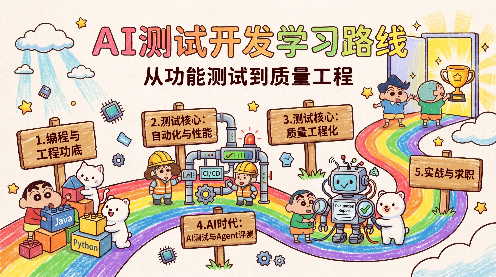

<h1 align="center">🔥 AI 测试开发学习路线大全</h1>

  <a href="./README.md">简体中文</a> · <a href="./README.en.md">English</a>

  <b>从功能测试到质量工程的完整成长地图：先练扎实基本功，再借 AI 提效 —— 免费开源，持续更新 🚀</b>

  
  
  

  

软件测试开发正在被 AI 重塑：用例可以让 AI 出初稿，脚本可以让 AI 帮忙写，但「判断测得够不够、质量有没有滑坡、问题出在哪一层」仍然需要人。这个仓库整理了一条从零基础到测试开发工程师（SDET）的完整学习路线：既打牢传统测试开发的功底，也补上 AI 时代的两门新功课——用 AI 提效测试，以及评测 AI 应用本身。

## 这份路线适合谁

- **在校学生 / 应届毕业生**：计算机相关专业或零基础转行，准备走测试开发、自动化测试、质量工程方向，需要一条从零到能求职的完整路径
- **功能 / 业务测试工程师**：正在做手工或功能测试，业务熟悉但编程薄弱，想补齐编程、自动化和工程化能力，转型测试开发
- **程序员 / 后端开发**：有 Java、Python 或后端开发基础，看好质量工程方向的机会，想把求职面扩展到测开
- **在职测试工程师（社招进阶）**：已经会一些自动化，遇到能力瓶颈，想突破性能测试、质量平台、精准测试等进阶能力，冲击更高岗位和薪资
- **想学 AI 测试的工程师**：无论测试还是开发背景，想把 AI 真正用进测试工作，或切入 AI 应用评测（RAG / Agent / 大模型）这个新方向

不同背景不必从头读到尾：[路线总览](./docs/roadmap/README.md) 为「功能测试转测开」「后端转测开」「校招零基础」三条路径做了定制裁剪，社招进阶可按目标岗位选学第 8-11 章。

## 学习路线全景图

| 阶段                                          | 章节                                                           | 修炼境界        | 核心能力                                                                           |
| --------------------------------------------- | -------------------------------------------------------------- | --------------- | ---------------------------------------------------------------------------------- |
| **🧭 认知 · 建立岗位判断力**           |                                                                |                 |                                                                                    |
| 起点                                          | [01 认识测试开发](./docs/roadmap/01-what-is-sdet.md)            | 💨 练气期       | 岗位全景 · 测开到底在做什么 · AI 时代多学了什么                                  |
| **🧱 筑基 · 编程与工程功底**           |                                                                |                 |                                                                                    |
| 阶段一                                        | [02 计算机基础](./docs/roadmap/02-cs-fundamentals.md)           | 🧱 筑基初期     | 网络 · 操作系统 · 数据结构与算法                                                 |
| 阶段二                                        | [03 编程语言](./docs/roadmap/03-programming.md)                 | 🏗️ 筑基中期   | Python / Java 主语言 + 单测框架                                                    |
| 阶段三                                        | [04 工程基础](./docs/roadmap/04-engineering-basics.md)          | 🏯 筑基圆满     | MySQL · Redis 缓存 · 消息队列与 Nginx 中间件 · Linux · Git · Docker · K8s · CI/CD |
| **🧪 测试核心 · 从用例设计到质量工程** |                                                                |                 |                                                                                    |
| 阶段四                                        | [05 测试理论与用例设计](./docs/roadmap/05-testing-theory.md)    | ⚗️ 结丹期     | 六维用例框架 · 边界与异常思维                                                     |
| 阶段五                                        | [06 接口测试与接口自动化](./docs/roadmap/06-api-automation.md)  | 👶 元婴初期     | 框架分层 · 断言体系 · Mock 与数据构造                                            |
| 阶段六                                        | [07 UI 与 App 自动化](./docs/roadmap/07-ui-app-automation.md)   | 🧒 元婴中期     | Playwright · Selenium / Appium · POM                                             |
| 阶段七                                        | [08 性能与稳定性测试](./docs/roadmap/08-performance-testing.md) | 🧑 元婴后期     | 压测方法论 · 监控链路 · 瓶颈定位                                                 |
| 阶段八 | [09 CI/CD、质量平台与精准测试](./docs/roadmap/09-quality-engineering.md) | 👁️ 化神期 | CI/CD 流水线集成 · 测试平台 · 精准测试 |
| **🤖 AI 时代 · 提效与新赛道**          |                                                                |                 |                                                                                    |
| 阶段九 | [10 AI 辅助测试](./docs/roadmap/10-ai-assisted-testing.md) | 🦋 婴变初期 | AI 编程提效 · 提示词工程 · AI 生成用例与脚本 · AI 代码审查与失败归因 · MCP / Skill |
| 阶段十 | [11 AI 应用测试与大模型评测](./docs/roadmap/11-llm-evaluation.md) | ✨ 婴变圆满 | Dify 知识库 / Workflow 搭建 · 评测集建设 · RAG / Agent / 安全评测 · LLM-as-a-Judge · 上线门禁与 bad case 回流 |
| **🚀 实战与求职 · 把能力兑现成 offer** |                                                                |                 |                                                                                    |
| 实战                                          | [12 项目实战指南](./docs/roadmap/12-project-practice.md)        | ⚔️ 问鼎初期   | 4 个递进项目：接口框架 → UI/App → 性能定位 → AI 评测平台                        |
| 面试                                          | [13 面试准备](./docs/roadmap/13-interview-guide.md)             | 🏆 问鼎 · 飞升 | 分类题库 · 项目叙事与表达框架                                                     |

> 阶段六、七可以并行学习；从阶段五（接口自动化）开始就可以用 AI 提效，不必等传统技能全部学完。
>
> 🎮 修练须知：各位道友，境界不靠打坐，靠每章末尾的「自查清单」渡劫；跳级容易走火入魔，收藏不学则道基尽毁 😄

先看 [路线总览](./docs/roadmap/README.md)：里面有不同背景的定制路线、3-6 个月学习节奏和优先级建议。

## 内容规划

| 目录                                        | 状态     | 说明                                               |
| ------------------------------------------- | -------- | -------------------------------------------------- |
| [docs/roadmap](./docs/roadmap/README.md)     | 持续更新 | 学习路线主线，按阶段成章                           |
| [docs/knowledge](./docs/knowledge/README.md) | 规划中   | 知识点单篇深入：Playwright 实战、JMeter 报告解读等 |
| [docs/interview](./docs/interview/README.md) | 规划中   | 分类面试题库与参考回答                             |
| [docs/resources](./docs/resources/README.md) | 规划中   | 工具清单、书籍与课程汇总                           |

## 如何使用这份路线

1. 别一上来就收藏一堆工具教程。工具上手很快，拉开差距的是测试代码质量、工程化接入和问题定位能力。
2. 每章末尾有「自查清单」，能独立回答里面的所有问题，这一章才算过关。
3. 学完前五个阶段就动手做项目，边做边补，不要等「全部学完」再开始。
4. AI 相关的两章（10、11）建议尽早读，哪怕还做不了 AI 应用评测，也应该先建立判断力。

## 配套资源（AI 测试开发导航）

本仓库与 [AI 测试开发导航](https://www.testfather.cn/) 配套建设，以下在线资源与路线同步更新：

| 资源                                                       | 说明                             |
| ---------------------------------------------------------- | -------------------------------- |
| [学习路线](https://www.testfather.cn/learning-paths)        | 在线版学习路线，支持进度跟踪     |
| [教程专栏](https://www.testfather.cn/tutorials)             | 分阶段实战教程，与本仓库章节配套 |
| [面试刷题](https://www.testfather.cn/interviews)            | 测开高频面试题在线练习           |
| [面试测评](https://www.testfather.cn/interviews/assessment) | 能力自测，定位薄弱环节           |
| [简历模板](https://www.testfather.cn/resume-templates)      | 测试开发求职简历模板             |
| [Skill 技能商店](https://www.testfather.cn/skills)          | AI 测试提效技能与提示词工具      |
| [精品课程](https://www.testfather.cn/courses)               | 体系化测试开发课程               |

## 交流渠道

修练路上有道友同行会走得更远，欢迎通过以下方式和我连接：

| 作者微信（备注「测开学习」） | 官方公众号「测试开发技术」 | 知识星球（微信扫码加入星球） |
| ---------------------------- | -------------------------- | ---------------------------- |
|  |  |  |

- **作者微信**：加好友备注「测开学习」，拉你进测试开发交流群，和一群同行者互相督促
- **官方公众号「测试开发技术」**：AI 提效技巧、测开技术干货、行业动态，内容更新第一时间推送
- **知识星球**：微信扫码加入星球，与更多测开同行者深度交流

## 参与共建

如果你也是测试开发的实践者、AI 探索者，并且乐于分享和沉淀你的实战经验与踩坑记录，欢迎各位道友加入进来参与共建，一起打磨属于AI时代，所有测开人的成长路线！

🎉 **你将收获：**

| 收获          | 说明                                           |
| ------------- | ---------------------------------------------- |
| 🌟 影响力提升 | 在活跃社区中展示专业判断，建立个人品牌与声誉   |
| 📚 深度学习   | 接触多元视角，与同行切磋，加速个人成长         |
| 🏆 价值认同   | 你的贡献将被明确署名，获得社区成员的尊重与感谢 |
| 🤝 拓展人脉   | 连接志同道合的伙伴，融入充满活力的测开生态圈   |

**如何参与：**

- 内容纠错、补充资源、分享学习经验：欢迎提 [Issue](https://github.com/zhoujinjian/ai-testing-guide/issues) 和 [PR](https://github.com/zhoujinjian/ai-testing-guide/pulls)，参见[贡献指南](./CONTRIBUTING.md)
- 想深度参与内容共建：加作者微信（见上方[交流渠道](#交流渠道)），备注「共建」

## 感谢 Star

如果这份路线对你有帮助，请给一个 **Star** ⭐️ 支持一下，你的认可是持续更新的动力！

## 📌 版权与转载声明

- 本仓库文档内容采用 [CC BY-NC-SA 4.0](./LICENSE) 协议发布：
  - ✅ 个人学习、博客署名转载自由（请注明出处并保留链接）
  - ❌ 未经授权，禁止用于商业用途、付费专栏、培训课程
  - 🔄 基于本文档的二次创作需沿用相同协议
- 仓库中的示例代码采用 MIT 协议，可自由使用
- 转载请在文首注明：作者 **狂师** · 出处 https://github.com/zhoujinjian/ai-testing-guide
- 如发现恶意抄袭/搬运（包括公众号、CSDN 付费专栏），将依法维权

## 更新日志

- 2026-08：v1 首发，完整 10 阶段学习路线 + 4 个实战项目 + 面试指南。
