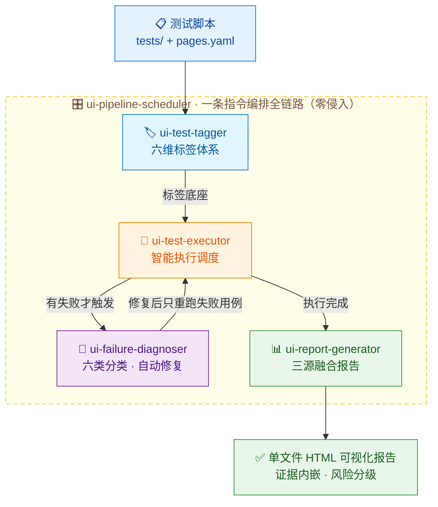
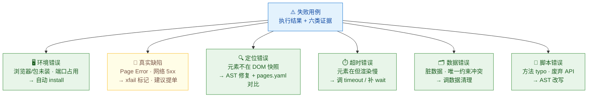
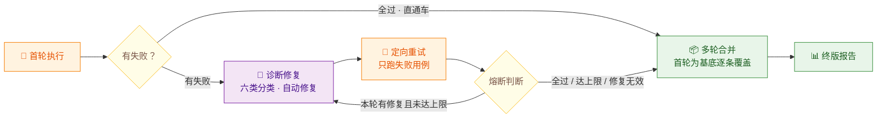

# AI 测试实战系列 20｜UI 自动化·执行到报告全流程串联：4+1 Skill 架构收官

> AI 测试实战系列（共 20 篇）｜ 01 用例设计（接口/UI 通用） · 接口自动化 02-10 · UI 自动化 11-20 ｜ 本文第 20 篇 · 全系列收官

---


做过 UI 自动化的团队都懂，写脚本只是第一步，真正的痛苦往往是从「执行测试」开始：

- **跑测试**，手拼 `pytest -m` 表达式筛用例，标签错一个字母，全量几百条跑飞，一等半小时。
- **挂了**，没截图、没录屏、没 Trace，失败现场转瞬即逝，想复现全靠缘分。
- **排查**，对着满屏英文堆栈猜原因，猜环境、猜数据、猜前端改了东西，一下午搭进去。
- **修脚本**，改定位、调超时、清脏数据，定位到了还是一条条人肉动手。
- **出报告**，从 XML 数数字、去目录翻截图、计算器算通过率，手工拼一下午。

自动化测试执行阶段，是整个测试体系里，翻车率最高、最消耗人、也最值得 AI 赋能的一段。

本篇给大家分享 5 个 Agent Skill，串起「标签怎么打、脚本怎么跑、挂了怎么修、结果怎么报」完整链路的。这也是整个系列的收官篇。


## 一、UI 测试的痛，远不止跑脚本

很多团队一提到执行环节的痛点，第一反应就是「环境问题」。但实际上，**环境只是冰山一角。**

从用例管理到流程编排，UI 测试的执行阶段每一个环节都有让人崩溃的地方：

| 环节       | 痛点             | 典型表现                           |
| :------- | :------------- | :----------------------------- |
| **标签管理** | 用例没分级分类，没法按需执行 | 几百条用例一把梭，想只跑登录模块的 P0 冒烟，得手拼长命令 |
| **测试执行** | 环境、筛选、证据、并行全是坑 | 「我本地明明能跑」成 CI 经典开场白；失败现场一次性    |
| **失败诊断** | 原因靠猜，误判代价大     | 环境问题提单被开发退回；真 bug 当偶发失败漏到线上    |
| **测试报告** | 手工拼表，只有数字没结论   | 报告发到群里，老板回一句，所以能不能发？           |
| **流程编排** | 环节各自为战，人当传话筒   | 执行、诊断、重跑、报告，一条链要人叫四次 AI        |

**这五个环节的痛点，单靠一个 Skill 解决不了。**

很多新手容易踩的坑：想做一个「万能执行 Skill」，一条命令从跑测试一路干到出报告，执行、诊断、修复、报告全塞在一起。结果就是逻辑臃肿、出错难定位、环节没法单独用。

正确的做法还是那句话，**按职责拆分，每个 Skill 只做一件事，做到极致。**

## 二、4+1 Skill 全流程架构

先看全貌。UI 测试执行侧的 AI 赋能链路，由 **4 个核心 Skill + 1 个编排 Skill** 组成，形成完整闭环：

| Skill                         | 核心职责      | 解决什么痛点                 |
| :---------------------------- | :-------- | :--------------------- |
| **ui-test-tagger**            | 脚本标签化管理   | 用例没分级分类、没法按需执行、筛选靠手拼命令 |
| **ui-test-executor**          | 智能执行调度    | 环境翻车、失败无现场、并行矩阵重试自己搭   |
| **ui-failure-diagnoser**      | 失败诊断与自动修复 | 失败原因靠人猜、误判代价大、修复靠人肉    |
| **ui-report-generator**       | 可视化测试报告   | 报告手工拼、只有数字没结论、证据翻不着    |
| **ui-pipeline-scheduler**（编排） | 全链路统一编排   | 环节靠人串、重试没规矩、接不进 CI     |




**这几个 Skill 形成完整闭环：** `标签 → 执行 → 诊断 → 报告`，由 `scheduler` 统一编排，既能串联使用，也能独立调用。

```bash
测试脚本 (tests/ + pages.yaml)
  │
  ▼
ui-test-tagger ──→ 六维标签体系 + 标签统计报告
  │
  ▼
ui-test-executor ──→ 执行结果 + 六类失败证据（截图/录屏/Trace/日志）
  │
  ├──→ ui-failure-diagnoser ──→ 六类分类 + 自动修复 + 验证回滚
  │            │
  │            ▼
  │     ui-test-executor（定向重试，只跑失败用例）
  │
  ▼
ui-report-generator ──→ 单文件 HTML 可视化报告（证据内嵌、风险分级）
  │
  ▴
  └── ui-pipeline-scheduler 把以上全部串成一条指令（零侵入编排）
```

**为什么这么拆？**

还是那三个原则：

1. **单一职责**：每个 Skill 只做一类核心动作（打标、执行、诊断、报告），编排层只编排不干活。
2. **闭环衔接**：tagger 的标签是 executor 的筛选依据，executor 的证据是 diagnoser 的诊断依据，全部产物汇入 report-generator。
3. **灵活复用**：每个 Skill 都能独立调用。只想跑测试，单独用 executor；已有失败要排查，单独用 diagnoser；拿到结果要出报告，单独用 report-generator。

接下来，逐个拆清楚每个 Skill 的定位和作用。

## 三、逐个拆解：每个 Skill 的定位与作用

### Skill 1：ui-test-tagger — 脚本标签化管理

**定位：用例管理地基 Skill，为 Playwright + POM + Pytest 的 UI 测试脚本自动打上标准化标签，建立可筛选、可过滤、可统计的标签体系，为按标签执行、按模块生成报告、按优先级调度、按浏览器分发提供基础。**

**它解决什么问题？**

脚本生成技能一跑就是几百条用例，没有标签体系，后面按需执行、按模块统计、按优先级调度，全都无从谈起。

**适用场景：**

- 为 UI 测试脚本批量打标签、检测冲突、补全缺失标签
- 按模块/场景/页面/优先级分类管理 Playwright 用例
- 生成标签分布统计报告
- 结合 pytest ` -m` 实现冒烟、回归、模块化执行

**核心能力：**

- **六维标签体系**：优先级（P0-P3）、模块（module:xxx）、场景（scene:xxx）、页面类型（page:xxx）、执行策略（run:smoke/regression/full）、浏览器平台（browser:xxx）
- **智能推荐：解析方法名、docstring、`page.goto()` 路径、Playwright 操作步骤、断言内容，参照 pages.yaml 推断模块和优先级
- 冲突检测：自动检测优先级、场景、策略、页面类型冲突
- 装饰器映射：`module:login` → `@pytest.mark.module_login`，含冒号标签自动转下划线
- 三种模式：analyze（仅分析）/ apply（写入）/ report（仅统计），默认 analyze 安全优先

**输入：**

- 测试脚本目录（`tests/`）
- `pages.yaml`（可选，用于辅助模块和优先级推断）

**输出：**

- 自动打好六维标签的测试脚本
- 标签统计报告（`ui_tag_statistics.md`）

**核心价值：**

把「一堆平铺的脚本文件」变成「一套可管理的用例资产」。它是执行调度的前提，一句「只跑购物车 P0 冒烟」能被准确翻译，靠的就是这套标签底座。

### Skill 2：ui-test-executor — 智能执行调度

**定位：测试执行的核心引擎，把「跑测试」从手拼命令变成一句自然语言。**


**它解决什么问题？**

传统执行方式下，环境靠玄学（「我本地明明能跑」）、筛选靠翻文档（手拼 marker 表达式）、失败现场一次性（没截图没 Trace）、并行跨浏览器重试样样自己搭。执行环节规则明确、重复劳动、容易遗漏，是 AI 接管收益最高的一环。

**适用场景：**

- 触发执行 UI 测试、按标签/模块/优先级筛选
- 跨浏览器矩阵执行、并行加速、失败重试
- 自动采集失败截图、录屏、Trace、Console 日志、Page Source
- 生成 JUnit XML / HTML / JSON 多格式报告，便于 CI 集成


**核心能力：**

- **执行前先亮牌**：自动浏览器检测（Playwright 内置 + 系统浏览器），无可用浏览器时引导安装，开跑前打印浏览器环境清单（版本、无头支持）+ 待执行用例清单（含参数化展开），配合 dry-run 先验证调度逻辑
- **自然语言筛选用例**：依托 tagger 的标签体系，「只跑购物车 P0 冒烟」直接翻译成 marker 表达式，优先级累积、多标签交集、多模块并集，贴合测试直觉
- **六类失败证据自动采集**：截图（视口+全页）、录屏、Trace、控制台五段日志、页面源码、网络请求摘要，**只在失败时采集**，通过的不占一块磁盘
- **并行、矩阵、重试**：一句「并行跑」「三个浏览器各跑一遍」「偶发失败自动重试」全部支持
- **报告五件套**：JSON / HTML / JUnit XML / Markdown 摘要 / 单行 CI 摘要，有失败自动追加深度分析报告

**输入：**

- 测试脚本目录（已打标签）
- 执行意图（自然语言或参数：范围、优先级、浏览器、并行数）

**输出：**

- 标准化执行结果（JUnit XML / JSON）+ 六类失败证据（artifacts/）

**核心价值：**

把执行环节固化成「标签筛选、环境检测、执行调度、现场采集、报告产出」五步流程。跑得明白，跑得有据可查。

### Skill 3：ui-failure-diagnoser — 失败诊断与自动修复

**定位：失败分析的智能大脑，不只给建议，直接把修复做掉。**




**它解决什么问题？**

executor 留下了证据，但判断还是要人做。对着堆栈猜原因、误判方向白干半天、真 bug 当偶发漏到线上、修一条改一行——诊断环节最吃经验，也最重复。而它有一条硬约束兜底，**永远不修改测试用例的断言和业务语义**，修的有边界，才敢放心让它修。


**核心能力：**

- **六类失败自动分类**：环境 / 定位 / 超时 / 数据 / 脚本 / 真实缺陷，每类有明确判定信号，按优先级判定（环境挂了一切无意义）
- **十四种根因定位**：判定信号 + 失败证据交叉验证。最典型的一招，同样是 Timeout 报错，打开失败瞬间的 DOM 快照看元素在不在，在就是渲染慢调等待，不在就是定位漂移修定位
- **四类修复直接落地**：AST 改写定位器和超时（pages 层）、自动装环境（playwright install）、调数据清理技能处理脏数据、真实缺陷打 xfail 标记不掩盖
- **修完自动验证**：每处修复重跑单用例，修不好自动回滚备份
- **全程留痕**：审计日志 + 修复报告（分类统计、根因统计、每条明细）

**输入：**

- executor 输出的执行结果（JUnit XML）+ 失败证据（artifacts/）
- 项目目录与 `pages.yaml`（定位修复的金标准）

**输出：**

- 修复后的代码 + 数据 + `ui_repair_report.md` 诊断报告

**核心价值：**

以前失败是负担，现在失败是数据。每条失败都有分类、有根因、有处理结果，跑上几轮，哪个模块最脆弱、哪类问题最频繁，报告直接告诉你。

### Skill 4：ui-report-generator — 可视化测试报告

**定位：把执行结果、诊断结论、历史数据融合成能支撑发布决策的单文件报告。**


**它解决什么问题？**

活干完了，汇报掉链子。数据散在 XML、截图、诊断报告、历史邮件里四处躺着，人工拼表一下午，算错一个数被打回重算。报告里写着「通过率 85%」，然后呢？能不能发？风险在哪？老板要的是判断，拿到手的是一堆表格。

**核心能力：**

- **三源数据融合**：执行结果 + 诊断结论 + 历史趋势，一处合并口径统一
- **总览大盘**：六张 KPI 卡（总数/通过/失败/跳过/通过率/耗时）+ 状态饼图 + 模块柱图 + 历史趋势折线
- **浏览器矩阵**：Chromium / Firefox / WebKit 通过率并排对比，跨浏览器不一致一眼现形（UI 测试特有）
- **失败详情证据直达**：截图内联、录屏外链、「打开 Trace」按钮一键复制回放命令
- **风险分级 + 优化建议**：通过率低于 70% 标高风险，失败按根因聚类，直接给出「先修什么」

**输入：**

- 执行结果（JUnit XML / JSON）+ 诊断报告 + artifacts + 历史数据

**输出：**

- 单文件 HTML 可视化报告（所有样式、图表、截图全内联，双击就能打开）

**核心价值：**

测试做了一百分，汇报也能讲出一百分。报告是给决策看的，不是给存档看的，三分钟回答那个终极问题，能不能发，风险在哪。

### Skill 5（编排）：ui-pipeline-scheduler — 全链路统一编排

**定位：不当球员，只当指挥。把四个 Skill 串成一条指令跑完的流水线。**




**它解决什么问题？**

四个 Skill 各自能打，但串链子的活还是人干，执行完看一眼、诊断完叫重跑、跑完再叫报告，一条链人要叫四次 AI，中间衔接全靠人盯。而且这种多环节流程，CI 里根本没法落地。

**核心能力：**

- **五阶段闭环**：执行 → 诊断 → 重试 → 合并 → 报告，一条指令按序自动走完
- **零侵入编排**：不改任何子 Skill 的代码、入参、出参，只传参、读产物、控顺序。子技能单独调用完全不受影响
- **全绿直通车**：首轮全过直接跳到报告，不为「流程完整」空跑环节
- **熔断兜底**：重试到上限、修复无效、全部通过，三种条件立即停机；仍有失败会明确标出「这几条机器修不好」，附用例清单
- **多轮结果合并**：重试只跑失败用例会覆盖结果文件（首轮 8 条变 3 条），合并步骤以首轮为基底逐条覆盖，报告数字不失真

**输入：**

- 测试项目目录 + 执行参数 + 重试上限（默认 2 轮）

**输出：**

- 融合全部轮次信息的终版 HTML 报告 + 各轮留档

**核心价值：**

单个 Skill 是能力，编排才是生产力。测试同学从「盯着每个环节的操盘手」，变成「定好参数看报告的决策者」。

## 四、除了 4+1 核心架构，还可以按需集成

上面的 4+1 Skill 覆盖了 UI 测试执行侧的核心闭环。Skill 体系的价值发挥，还取决于与现有研发工具链的集成深度，常见方向：

| 集成方向 | 做法 | 适用场景 |
| :--- | :--- | :--- |
| **CI/CD 集成** | pipeline 单入口接 Jenkins / GitLab CI / GitHub Actions | 代码提交即测试，报告自动归档 |
| **代码仓库集成** | Git 感知前端代码变更，自动触发对应测试集 | 前端改版后的自动回归 |
| **消息通知集成** | 报告生成后自动推送钉钉 / 企微 / 邮件 | 失败预警、报告触达 |
| **定时调度集成** | 夜间定时全量回归，早上看报告 | 版本发布前的完整验证 |

**核心原则：先把 4+1 Skill 的闭环落地，再做集成扩展，避免过度设计。**

## 五、全流程串联回顾

把整条链路用命令行风格串起来，就是这样的：

```bash
# 0. 前提：一套现成的测试脚本
   tests/ + pages/ + pages.yaml   ← 已编写好的 UI 自动化项目

# 1. 第一站：标签管理
   /ui-test-tagger 给 tests/ 下的脚本建立六维标签体系
      ├─ 语义推断（方法名/docstring/goto/断言 + pages.yaml）
      ├─ 冲突检测 + 缺失补全
      └─ 输出打标脚本 + 标签统计报告

# 2. 第二站：执行调度
   /ui-test-executor 只跑购物车 P0 冒烟，Chrome 无头，失败要截图和 Trace
      ├─ 环境清单 + 用例清单（执行前亮牌）
      ├─ 自然语言 → marker 表达式
      ├─ 执行 + 失败时六类证据自动采集
      └─ 输出 JUnit XML + artifacts/ + 报告五件套

# 3. 第三站：诊断修复（有失败才触发）
   /ui-failure-diagnoser 刚才挂的用例，能修的自动修，修完验证
      ├─ 六类分类 + 十四种根因（看证据判方向）
      ├─ 自动修复：定位/超时/环境/数据/缺陷标记
      ├─ 修完重跑单用例验证，不行自动回滚
      └─ 输出修复代码 + ui_repair_report.md

# 4. 第四站：报告生成
   /ui-report-generator 把这轮结果和诊断结论生成报告
      ├─ 执行 + 诊断 + 历史三源融合
      ├─ KPI 大盘 + 浏览器矩阵 + 风险分级
      └─ 输出单文件 HTML，证据内嵌直达

# 5. 终点站：一键编排（把 1-4 串成一句话）
   /ui-pipeline-scheduler 一键全跑 P0，失败自动诊断修复重试，最后出报告
      ├─ 执行 → 诊断 → 重试 → 合并 → 报告 自动接力
      ├─ 全绿直通 / 熔断兜底 / 多轮合并不失真
      └─ 人只说一句话，回来直接看报告
```

## 六、AI 负责干活，人负责把关

这里有一个关键问题必须说清楚，**AI 把测试跑完、修完、报告出完，测试工作没有结束。**

这套 4+1 Skill 能帮你完成的是「打标、执行、诊断、报告」这些动作，把数小时甚至数天的体力劳动压缩到几分钟。但以下这些事情，AI 做不了，仍然需要人来把关：

| AI 负责的事 | 人负责的事 |
| :--- | :--- |
| 六维标签自动推断 | 抽查模块归属、优先级是否符合业务实际 |
| 自然语言翻译成用例筛选 | 确认筛选范围覆盖本次迭代的风险点 |
| 六类失败证据自动采集 | 看截图、看 Trace，判定缺陷归属 |
| 自动修复 + 验证回滚 | Review 修复的定位器是否符合业务语义 |
| 风险分级 + 优化建议 | 基于报告做出发布决策 |

**说白了，AI 负责把「从 0 到 80」的体力活干完，人负责「从 80 到 100」的质量把关。** 这样既高效，又不会失去对质量的控制。

> **特别提醒：** 有两个地方最容易松懈。一是「重试后全绿」不代表没问题，偶发失败里往往藏着时序问题和资源竞争，值得单独拎出来排查；二是「预期失败」标记不能代替确认，把所有失败都标成 xfail 让报告变绿，是用另一种方式掩盖问题。

## 七、Skill 源码与完整教程

大家可以按本文思路自己开发 Skill，现成技能包在 Skill 商店下载，地址 https://www.testfather.cn/skills。


## 写在最后

回顾一下整套架构：

**痛点：** 从用例管理到流程编排，UI 测试执行侧每个环节都耗时费力，且高度依赖人工临场判断。

**方案：** 不要搞万能 Skill，按职责拆成 4+1 个专业 Skill，形成 `标签 → 执行 → 诊断 → 报告` 的完整闭环，由编排层统一串联。

**效果：**

| 传统模式 | Agent Skill 模式 |
| :--- | :--- |
| 手拼 pytest -m 表达式，全量跑飞 | 一句自然语言，标签自动翻译 |
| 失败没截图没 Trace，现场一次性 | 六类证据自动保全，只在失败时采集 |
| 失败原因靠猜，修复靠人肉改代码 | 六类分类十四种根因，自动修复自动验证 |
| 报告手工拼一下午，只有数字没结论 | 一句指令几分钟出报告，风险分级直接给判断 |
| 执行诊断报告各自为战，人当传话筒 | 一条指令全链路自动跑完，可直接接 CI |

**边界：** AI 负责执行、诊断、修复和报告，人负责校验和决策。

**如果你想深入某个具体 Skill 的实操细节，可以看这个系列之前单独的拆解：**

1. ui-test-executor：智能执行调度（系列 15） — 标签筛选、环境检测、六类证据、并行矩阵
2. ui-failure-diagnoser：失败自动诊断修复（系列 16） — 六类分类、十四种根因、自动修复
3. ui-report-generator：测试报告生成（系列 17） — 三源融合、KPI 大盘、风险分级
4. ui-pipeline-scheduler：全链路流水线编排（系列 18） — 五阶段闭环、熔断兜底、多轮合并

其中 ui-test-tagger 是本篇新增的标签底座 Skill，未单独成篇，用法见上文 Skill 1。脚本生成那一侧的串联（解析 → 生成 → 增强 → 适配 → 维护），见系列 19。

---

**系列完结。** 到这里，AI 测试实战系列 20 篇全部更完。01 测前设计打底，02-10 接口自动化，11-20 UI 自动化，从用例设计、脚本生成到执行运营、报告决策，AI 赋能测试全流程的实战拼图，到这里凑齐了。

这 5 个 Skill，串起来是一条从执行到报告的完整流水线，拆开来是 5 件各自趁手的独立工具。UI 自动化最难啃的那段路，现在可以交给 AI 了。

---

**配套资源**

- Skill 工具包下载，https://www.testfather.cn/skills（星球成员已含网站会员，登录直接领）
- 完整开发设计教程与项目源码（含 30+ AI 测试全场景 Agent Skill），见「狂师 . AI 进化社」

**系列导航**（AI 测试实战系列，共 20 篇）

测前设计（接口 / UI 通用）

- [01 用例设计四件套](./01-testcase-design-toolkit.md)，generator-testcase-xmind / excel · safe-testcase · review-testcase

接口自动化 · 脚本开发

- [02 文档智能解析](./02-api-schema-parser.md)，api-schema-parser
- [03 测试数据构造](./03-api-testdata-generator.md)，api-testdata-generator
- [04 脚本批量生成](./04-api-testscript-generator.md)，api-testscript-generator
- [05 脚本质量优化](./05-api-test-optimizer.md)，api-test-optimizer

接口自动化 · 执行运营

- [06 智能执行调度](./06-api-test-executor.md)，api-test-executor
- [07 失败自动诊断修复](./07-api-failure-diagnoser.md)，api-failure-diagnoser
- [08 测试数据清理](./08-api-testdata-cleaner.md)，api-testdata-cleaner
- [09 测试报告生成](./09-api-report-generator.md)，api-report-generator
- [10 全链路流水线编排](./10-api-pipeline-scheduler.md)，api-pipeline-scheduler

UI 自动化 · 脚本开发

- [11 页面解析](./11-ui-page-parser.md)，ui-page-parser
- [12 脚本批量生成](./12-ui-testscript-generator.md)，ui-testscript-generator
- [13 脚本健壮性增强](./13-ui-testscript-enhancer.md)，ui-testscript-enhancer
- [14 视觉断言与多浏览器适配](./14-ui-visual-assert.md)，ui-visual-assert
- [19 脚本生成流水线串联](./19-ui-script-pipeline.md)，4+1 Skill 实战

UI 自动化 · 执行运营

- [15 智能执行调度](./15-ui-test-executor.md)，ui-test-executor
- [16 失败自动诊断修复](./16-ui-failure-diagnoser.md)，ui-failure-diagnoser
- [17 测试报告生成](./17-ui-report-generator.md)，ui-report-generator
- [18 全链路流水线编排](./18-ui-pipeline-scheduler.md)，ui-pipeline-scheduler
- [20 执行到报告全流程串联](./20-ui-full-flow-integration.md)，4+1 Skill 架构收官（全系列完结）
