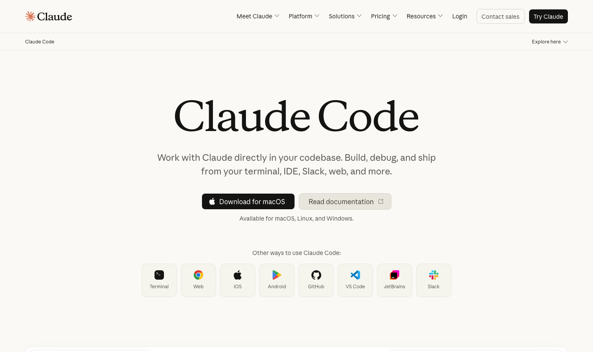

# Claude Code

> 终端编程 agent 的开创者，把「用自然语言驱动整个代码库」这件事真正跑通的产品。

## 工具简介

Claude Code 是 Anthropic 出品的终端编程 agent，skills、subagent、hooks 这套玩法都是它带起来的，如今生态最全，也是全行业被对标最多的那一个。如果你只想试一个 AI 编程工具，大多数人会先推荐它。

对测试开发而言，它也是目前自动化脚本生成、用例生成、CI 失败分析这些测试场景里生态最成熟的选择。

## 基本信息

| 项目 | 信息 |
| --- | --- |
| 出品方 | Anthropic |
| 工具形态 | 终端 Agent（另有 IDE 插件、Web 版） |
| 官网 | <https://claude.com/product/claude-code> |
| 项目地址 | <https://github.com/anthropics/claude-code>（Agent 代码开源，149k+ star） |
| 开源协议 | 主体服务闭源，Agent 代码开源 |
| 收费模式 | 订阅（Claude Pro/Max）或 API 按量 |

## 收录信息

- 收录自「测试开发技术」公众号文章《2026 年 AI 编程工具大全，33 个主流工具一次看懂》
- GitHub 数据核验于 2026-10；开源地址为收录时核验补充（原文未标注）
- [返回 AI 编程工具清单](./README.md)
