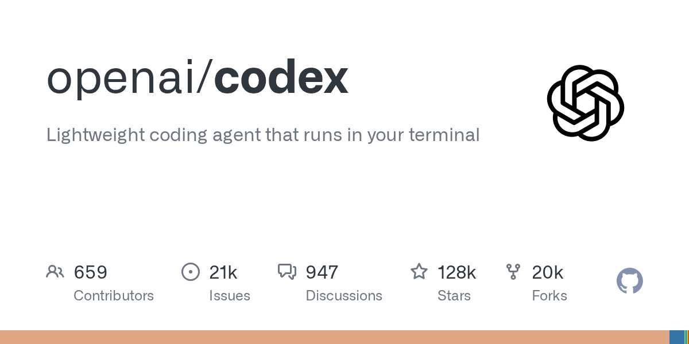

# Codex

> OpenAI 的官方 coding agent，跟 Claude Code 能掰手腕的另一个王炸产品。

## 工具简介

Codex 是 OpenAI 的官方 coding agent。终端 CLI 开源，云端是它的独门玩法——任务派出去在云上自己跑，改完提 PR 回来等你验收，适合「批量派活、集中验收」的工作方式。

ChatGPT 订阅自带额度、不另收费，对已有订阅的用户上手成本极低。

## 基本信息

| 项目 | 信息 |
| --- | --- |
| 出品方 | OpenAI |
| 工具形态 | 终端 CLI + 云端 Agent |
| 官网 | <https://developers.openai.com/codex/> |
| 项目地址 | <https://github.com/openai/codex>（128k+ star） |
| 开源协议 | Apache-2.0 |
| 收费模式 | ChatGPT 订阅自带额度，或 API 按量 |

## 收录信息

- 收录自「测试开发技术」公众号文章《2026 年 AI 编程工具大全，33 个主流工具一次看懂》
- GitHub 数据核验于 2026-10
- [返回 AI 编程工具清单](./README.md)
