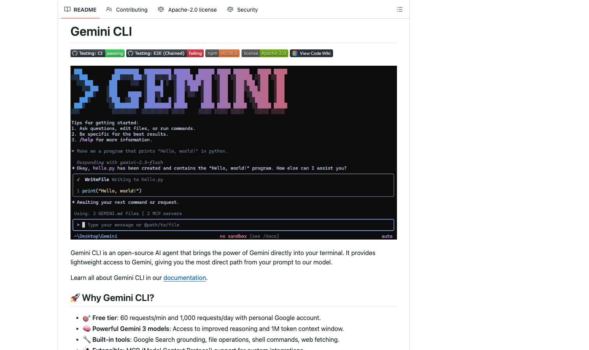

# Gemini CLI

> Google 官方的开源终端 agent，个人开发者每天能白嫖的量相当可观。

## 工具简介

Gemini CLI 是 Google 官方的开源终端 agent，Apache 协议，免费额度出了名的大方，个人开发者每天能免费用的量相当可观，是预算敏感开发者的首选之一。

多模态是它的独门优势——看图写代码、对着截图改 UI 这类活它最顺手。对测试开发而言，「扔一张 UI 截图让它生成/修正定位和断言」是很典型的用法。

## 基本信息

| 项目 | 信息 |
| --- | --- |
| 出品方 | Google |
| 工具形态 | 终端 CLI |
| 官网 | <https://github.com/google-gemini/gemini-cli>（官网即仓库） |
| 项目地址 | <https://github.com/google-gemini/gemini-cli>（107k+ star） |
| 开源协议 | Apache-2.0 |
| 收费模式 | 免费额度 + API 按量 |

## 收录信息

- 收录自「测试开发技术」公众号文章《2026 年 AI 编程工具大全，33 个主流工具一次看懂》
- GitHub 数据核验于 2026-10
- [返回 AI 编程工具清单](./README.md)
