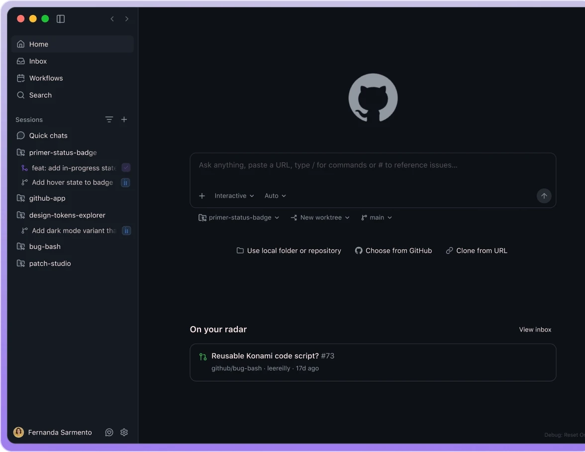

# GitHub Copilot

> 2021 年最早的 AI 代码补全，这几年从补全工具一路进化成全家桶。

## 工具简介

GitHub Copilot 是资格最老、渗透率最高的 AI 编程产品。这几年从补全工具一路进化成全家桶：IDE 插件、对话、CLI、网页端 agent 全都有。

企业采购时它往往是默认选项——和 GitHub 生态（仓库、PR、Actions）的深度集成是别家替代不了的，稳。

## 基本信息

| 项目 | 信息 |
| --- | --- |
| 出品方 | 微软 / GitHub |
| 工具形态 | IDE 插件 + CLI + Web Agent 全家桶 |
| 官网 | <https://github.com/features/copilot> |
| 项目地址 | 闭源 |
| 收费模式 | 订阅（个人 / 企业），有免费额度 |

## 收录信息

- 收录自「测试开发技术」公众号文章《2026 年 AI 编程工具大全，33 个主流工具一次看懂》
- [返回 AI 编程工具清单](./README.md)
