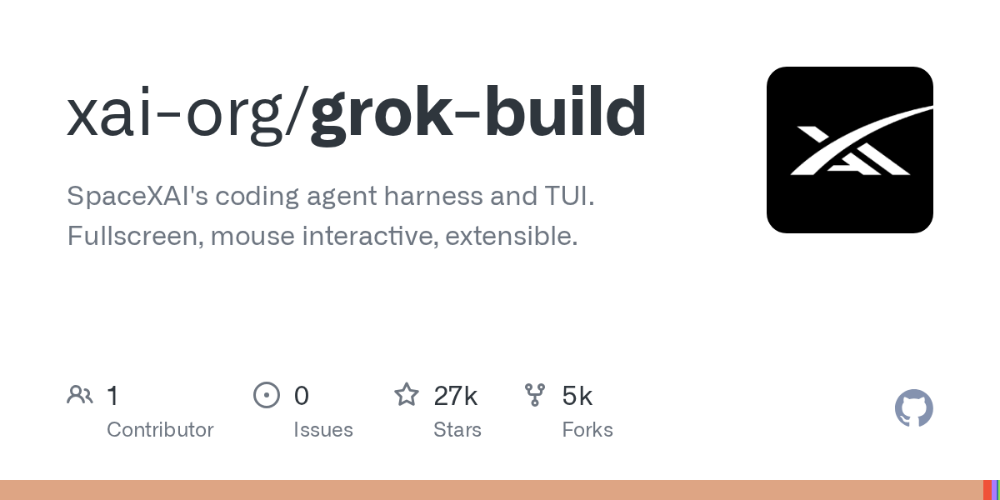

# Grok Build

> 马斯克家的终端 coding agent，热度恐怖。

## 工具简介

Grok Build 是 xAI 的终端 coding agent，Rust 写了约 80 万行，开源 9 天拿了 2 万 star。全屏 TUI、计划模式、子代理、MCP 一应俱会，功能阵容齐全。

缺点也明确：用起来贵。

## 基本信息

| 项目 | 信息 |
| --- | --- |
| 出品方 | xAI |
| 工具形态 | 终端 CLI（TUI） |
| 官网 | <https://x.ai/news/grok-build-cli> |
| 项目地址 | <https://github.com/xai-org/grok-build>（27k+ star） |
| 开源协议 | Apache-2.0 |
| 收费模式 | API 按量，成本偏高 |

## 收录信息

- 收录自「测试开发技术」公众号文章《2026 年 AI 编程工具大全，33 个主流工具一次看懂》
- GitHub 数据核验于 2026-10
- [返回 AI 编程工具清单](./README.md)
