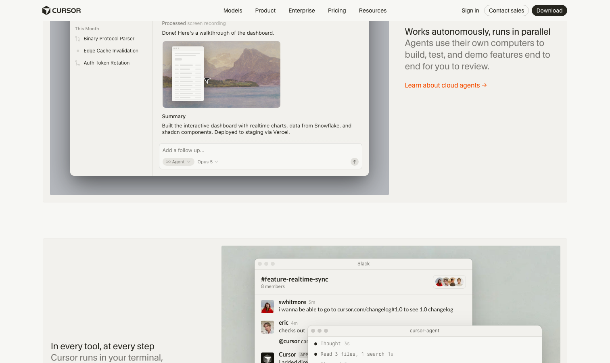

# Cursor

> AI 原生 IDE 的招牌，编辑器派的门面。

## 工具简介

Cursor 是 Anysphere 出品的 AI 原生 IDE，编辑器派的门面担当。Tab 补全的预测式编辑加上 Composer 的任务式生成，把「AI 写代码」的体验做成了行业标杆，营收增长是整个硅谷的神话级故事。

几乎所有后来者的 IDE 产品都在对标它的交互范式。

## 基本信息

| 项目 | 信息 |
| --- | --- |
| 出品方 | Anysphere |
| 工具形态 | AI 原生 IDE |
| 官网 | <https://cursor.com> |
| 项目地址 | 闭源（基于 VS Code 内核） |
| 收费模式 | 订阅（Hobby 免费 / Pro / Ultra） |

## 收录信息

- 收录自「测试开发技术」公众号文章《2026 年 AI 编程工具大全，33 个主流工具一次看懂》
- [返回 AI 编程工具清单](./README.md)
