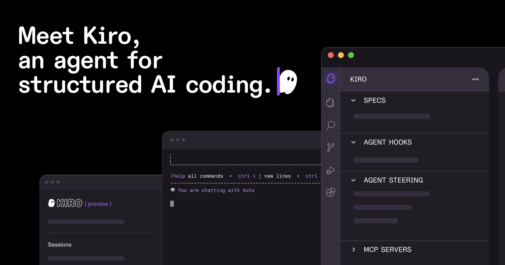

# Kiro

> 亚马逊的 spec 驱动 IDE，思路跟别人不一样。

## 工具简介

Kiro 是亚马逊的 spec 驱动 IDE：先写**需求、设计、任务**三段式规格，agent 照着规格干活。等于把研发流程本身管了起来。

这个模式特别适合团队协作和对交付质量有要求的场景——规格先行、按规格验收，和测试左移的思路天然契合（规格即可测性依据）。

## 基本信息

| 项目 | 信息 |
| --- | --- |
| 出品方 | AWS |
| 工具形态 | Spec 驱动 IDE |
| 官网 | <https://kiro.dev> |
| 项目地址 | 闭源 |
| 收费模式 | 订阅（有免费额度） |

## 收录信息

- 收录自「测试开发技术」公众号文章《2026 年 AI 编程工具大全，33 个主流工具一次看懂》
- [返回 AI 编程工具清单](./README.md)
