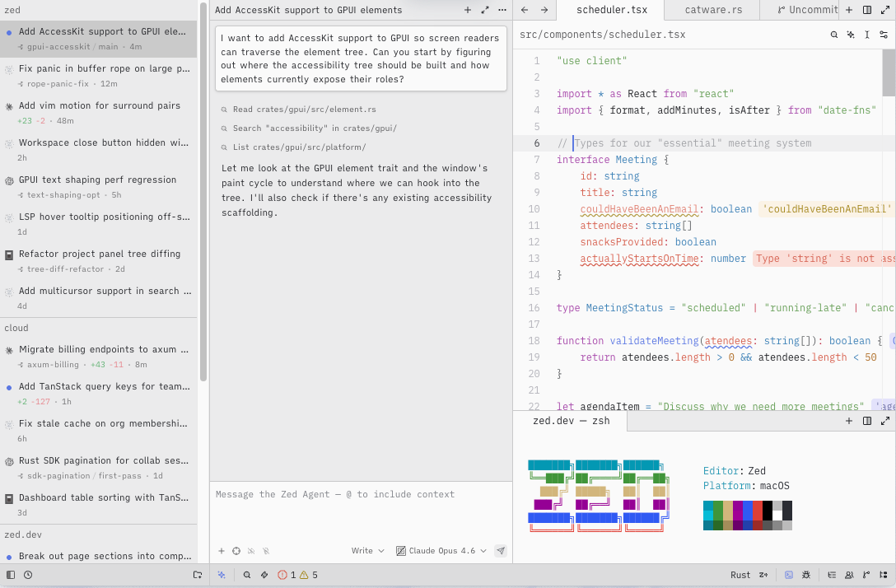

# Zed

> Atom 原作者 Nathan Sobo 的二次创业，把「快」做成信仰。

## 工具简介

Zed 是 Zed Industries 出品、用 Rust 写的编辑器，把「快」做成信仰——大项目里打开文件、搜索都是秒级，编辑器本体就值回票价。

AI 能力内置成 agent 面板，开源且迭代活跃，是「先把编辑器做好、再把 AI 做进去」路线的代表。

## 基本信息

| 项目 | 信息 |
| --- | --- |
| 出品方 | Zed Industries |
| 工具形态 | 代码编辑器（内置 Agent 面板） |
| 官网 | <https://zed.dev> |
| 项目地址 | <https://github.com/zed-industries/zed>（91k+ star） |
| 开源协议 | GPL / AGPL 混合（编辑器本体开源） |
| 收费模式 | 编辑器免费，AI 能力订阅或自带 Key |

## 收录信息

- 收录自「测试开发技术」公众号文章《2026 年 AI 编程工具大全，33 个主流工具一次看懂》
- GitHub 数据核验于 2026-10
- [返回 AI 编程工具清单](./README.md)
