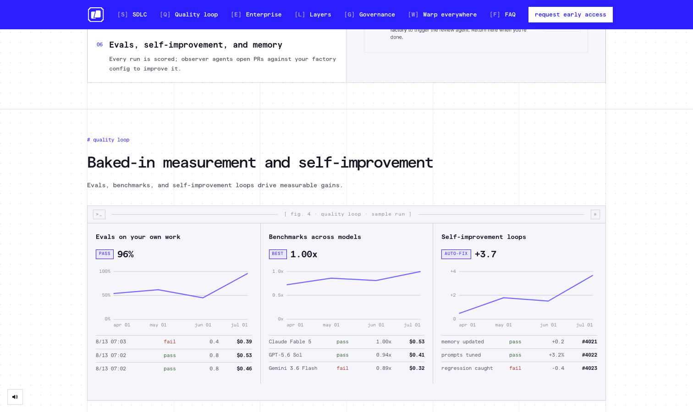

# Warp

> AI 终端的代表，把 shell 整个 agent 化了。

## 工具简介

Warp 是 Warp.dev 出品的 AI 终端，把 shell 整个 agent 化。一个会话里并行跑多个 agent 任务，终端输出还能直接当上下文喂回去——终端党的菜。

对习惯在终端里干活的测试开发（跑 pytest、看日志、起环境），它把「命令行 + AI」揉得最彻底。

## 基本信息

| 项目 | 信息 |
| --- | --- |
| 出品方 | Warp.dev |
| 工具形态 | AI 终端 |
| 官网 | <https://www.warp.dev> |
| 项目地址 | 闭源（Rust 客户端） |
| 收费模式 | 订阅（有免费额度） |

## 收录信息

- 收录自「测试开发技术」公众号文章《2026 年 AI 编程工具大全，33 个主流工具一次看懂》
- [返回 AI 编程工具清单](./README.md)
