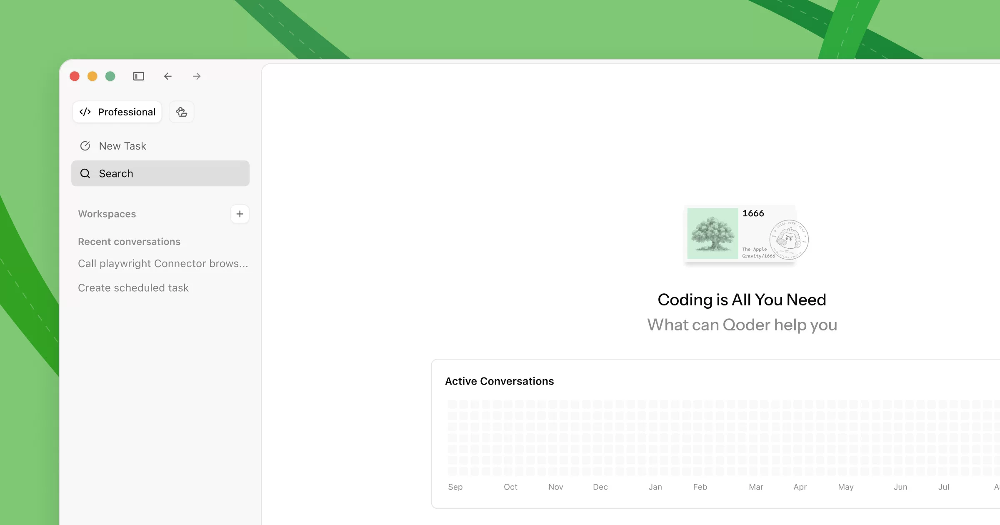

# Qoder

> 阿里出的 agentic IDE，Quest 模式很有辨识度。

## 工具简介

Qoder 是阿里出的 agentic IDE，Quest 模式很有辨识度——动手前先把你的意图问清楚再写码，规格驱动的思路。

免费额度慷慨，国内网络环境友好，是国内用户的低成本入门选项。

## 基本信息

| 项目 | 信息 |
| --- | --- |
| 出品方 | 阿里 |
| 工具形态 | Agentic IDE |
| 官网 | <https://qoder.com> |
| 项目地址 | 闭源 |
| 收费模式 | 免费额度 + 订阅 |

## 收录信息

- 收录自「测试开发技术」公众号文章《2026 年 AI 编程工具大全，33 个主流工具一次看懂》
- [返回 AI 编程工具清单](./README.md)
