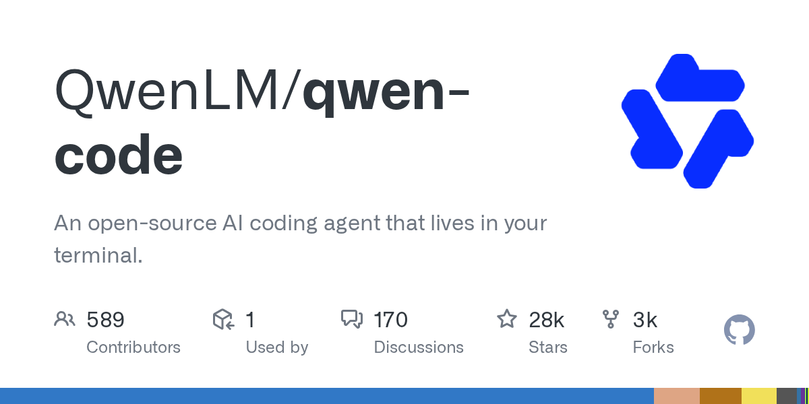

# Qwen Code

> 通义千问官方的编程 CLI，免费额度是国产代表。

## 工具简介

Qwen Code 是通义千问官方的编程 CLI，配合 Qwen3-Coder 模型，**模型和工具双开源**——这在国产阵营里是独一份。

免费额度是国产代表，白嫖党入门第一站；与 Gemini CLI 同源（基于其生态演化），用法迁移成本低。

## 基本信息

| 项目 | 信息 |
| --- | --- |
| 出品方 | 阿里通义 |
| 工具形态 | 终端 CLI |
| 官网 | <https://github.com/QwenLM/qwen-code>（官网即仓库） |
| 项目地址 | <https://github.com/QwenLM/qwen-code>（28k+ star） |
| 开源协议 | Apache-2.0 |
| 收费模式 | 免费额度慷慨 + API 按量 |

## 收录信息

- 收录自「测试开发技术」公众号文章《2026 年 AI 编程工具大全，33 个主流工具一次看懂》
- GitHub 数据核验于 2026-10
- [返回 AI 编程工具清单](./README.md)
