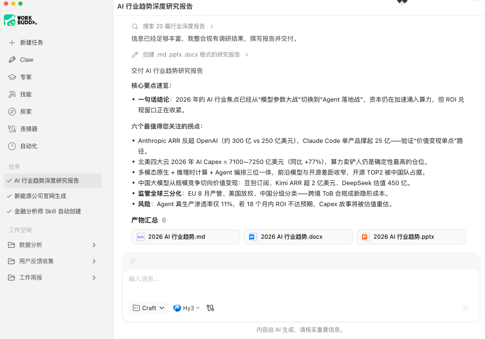

# WorkBuddy

> CodeBuddy 的办公分身，CodeBuddy 管开发，WorkBuddy 管办公。

## 工具简介

WorkBuddy 是腾讯的多 agent 并行办公工作台，报告、表格、PPT 都能交付。江湖总结得很到位：**CodeBuddy 管开发，WorkBuddy 管办公**（见 [CodeBuddy](./15-codebuddy.md)）。

对测试开发而言，写测试报告、汇总周报这类文档活可以让它先出初稿。

## 基本信息

| 项目 | 信息 |
| --- | --- |
| 出品方 | 腾讯 |
| 工具形态 | 多 Agent 办公工作台 |
| 官网 | <https://www.workbuddy.cn> |
| 项目地址 | 闭源 |
| 收费模式 | 免费额度 + 订阅 |

## 收录信息

- 收录自「测试开发技术」公众号文章《2026 年 AI 编程工具大全，33 个主流工具一次看懂》
- [返回 AI 编程工具清单](./README.md)
