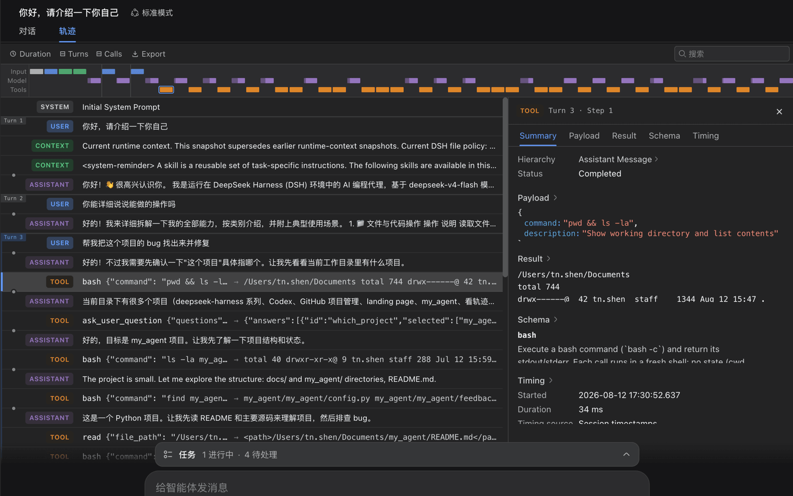

# DeepSeek Harness

> 上个月刚开源的 agent 框架，极度工程浪漫，很 DeepSeek。

## 工具简介

DeepSeek Harness 是深度求索开源的 agent 框架，设计理念是「**一切皆插件**」——模型、工具、会话、agent 循环全部可热插拔，还配了 88 页论文用数学证明插件装卸的安全性。

把「可组合性」做到极致的路线，适合想深度定制自己 agent 工作流的工程团队。

## 基本信息

| 项目 | 信息 |
| --- | --- |
| 出品方 | 深度求索（DeepSeek） |
| 工具形态 | Agent 框架 |
| 官网 | <https://github.com/deepseek-ai/deepseek-harness>（官网即仓库） |
| 项目地址 | <https://github.com/deepseek-ai/deepseek-harness>（245k+ star） |
| 开源协议 | MIT |
| 收费模式 | 开源免费，模型按 API 计费 |

## 收录信息

- 收录自「测试开发技术」公众号文章《2026 年 AI 编程工具大全，33 个主流工具一次看懂》
- GitHub 数据核验于 2026-10
- [返回 AI 编程工具清单](./README.md)
