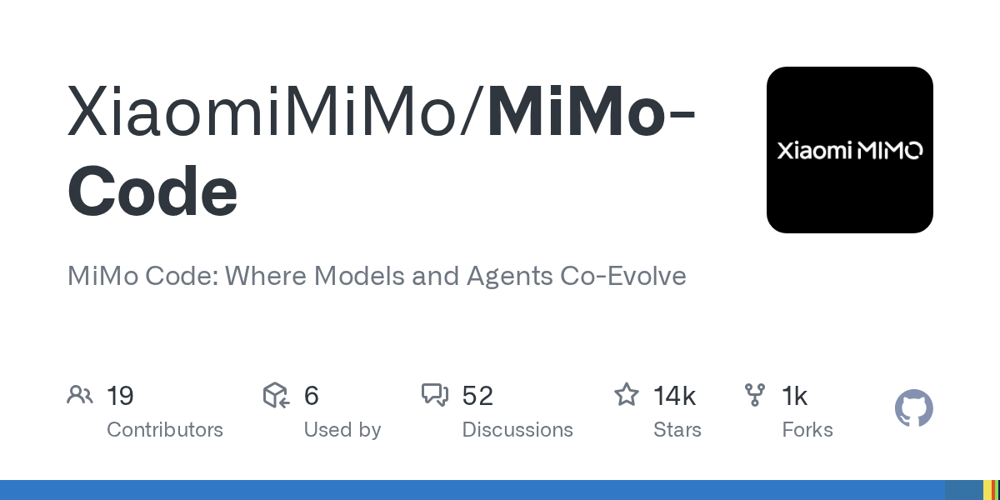

# Mimo

> 小米 MiMo 团队的终端 agent，主打长程任务。

## 工具简介

Mimo 是小米 MiMo 团队的终端 agent，基于 OpenCode 构建，MIT 开源。主打**长程任务**——围绕计算、记忆、进化三个主题设计，让它能扛几个小时起的大活（比如大规模脚本迁移、批量重构这种一口气跑很久的任务）。

## 基本信息

| 项目 | 信息 |
| --- | --- |
| 出品方 | 小米（MiMo 团队） |
| 工具形态 | 终端 Agent（OpenCode fork） |
| 官网 | <https://mimo.xiaomi.com> |
| 项目地址 | <https://github.com/XiaomiMiMo/MiMo-Code>（13k+ star） |
| 开源协议 | MIT |
| 收费模式 | 开源免费 |

## 收录信息

- 收录自「测试开发技术」公众号文章《2026 年 AI 编程工具大全，33 个主流工具一次看懂》
- GitHub 数据核验于 2026-10
- [返回 AI 编程工具清单](./README.md)
