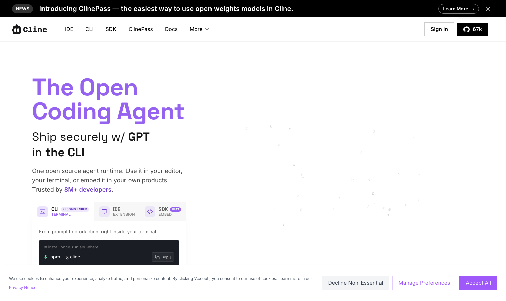

# Cline

> VS Code 开源 agent 插件的祖师爷，后面一串工具都是它的后代。

## 工具简介

Cline 是 VS Code 开源 agent 插件的祖师爷——计划和执行双模式的开创者，MCP 协议的早期推动者。后面的 Roo Code、Kilo Code 都是从它长出来的后代。

开源、免费、自带 Key 即用，是「不绑订阅」路线的起点级项目。

## 基本信息

| 项目 | 信息 |
| --- | --- |
| 出品方 | Cline（社区） |
| 工具形态 | VS Code 插件 |
| 官网 | <https://cline.bot> |
| 项目地址 | <https://github.com/cline/cline>（70k+ star） |
| 开源协议 | Apache-2.0 |
| 收费模式 | 开源免费，模型自带 Key 或用其转发 |

## 收录信息

- 收录自「测试开发技术」公众号文章《2026 年 AI 编程工具大全，33 个主流工具一次看懂》
- GitHub 数据核验于 2026-10
- [返回 AI 编程工具清单](./README.md)
