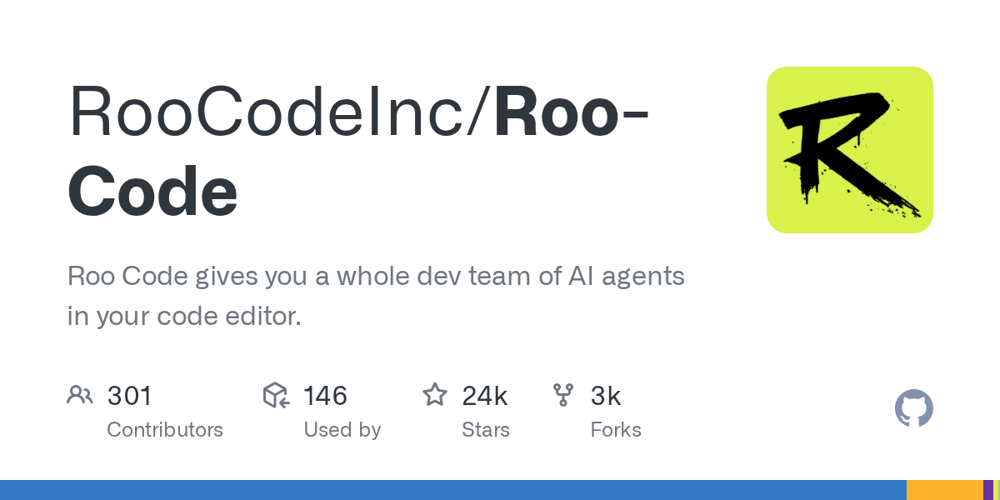

# Roo Code

> 从 Cline 社区里长出来的 fork，迭代速度很快。

## 工具简介

Roo Code 是从 Cline 社区里长出来的 fork，自定义 modes 玩出了花——你可以给不同任务配不同的 agent 人格（代码模式、架构模式、问答模式各一套提示词和权限）。

社区活跃度惊人，迭代速度很快，是「社区驱动迭代」路线的代表。

## 基本信息

| 项目 | 信息 |
| --- | --- |
| 出品方 | Roo 社区（Cline fork） |
| 工具形态 | VS Code 插件 |
| 官网 | <https://roocode.com> |
| 项目地址 | <https://github.com/RooCodeInc/Roo-Code>（24k+ star） |
| 开源协议 | Apache-2.0 |
| 收费模式 | 开源免费，模型自带 Key |

## 收录信息

- 收录自「测试开发技术」公众号文章《2026 年 AI 编程工具大全，33 个主流工具一次看懂》
- GitHub 数据核验于 2026-10
- [返回 AI 编程工具清单](./README.md)
