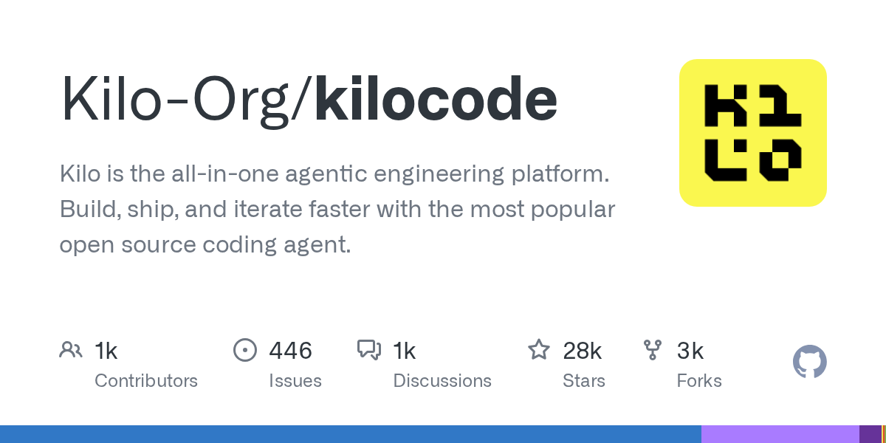

# Kilo CLI

> Kilo 家族的终端形态，IDE 和 CLI 之间无缝切换。

## 工具简介

Kilo CLI 是 Kilo 家族的终端形态，OpenCode 的 fork，配置和 Kilo 生态打通——IDE 里养好的 rules 和配置，到 CLI 里无缝复用。

被 Anaconda 收购后与 Kilo Code（IDE）合并进同一仓库维护（见 [Kilo Code](./25-kilo-code.md)）。

## 基本信息

| 项目 | 信息 |
| --- | --- |
| 出品方 | Kilo（已被 Anaconda 收购） |
| 工具形态 | 终端 CLI（OpenCode fork） |
| 官网 | <https://kilo.ai/cli> |
| 项目地址 | <https://github.com/kilo-org/kilocode>（与 Kilo Code 同仓库） |
| 开源协议 | MIT |
| 收费模式 | 开源免费，模型自带 Key 或订阅 |

## 收录信息

- 收录自「测试开发技术」公众号文章《2026 年 AI 编程工具大全，33 个主流工具一次看懂》
- GitHub 数据核验于 2026-10，仓库地址按核验结果修正
- [返回 AI 编程工具清单](./README.md)
