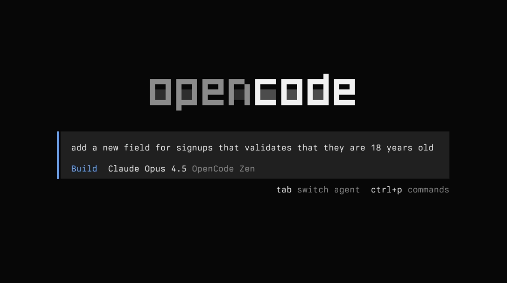

# OpenCode

> 开源终端 agent 的底座级项目，被 fork 本身就是一种认证。

## 工具简介

OpenCode 是开源终端 agent 的底座级项目——模型随便换，TUI 界面漂亮，LSP 集成干净。小米的 Mimo、Kilo CLI 都是 fork 它，**被 fork 本身就是一种认证**。

想要一个「不绑定任何厂商、配置完全自己说了算」的终端 agent，从它起步最稳。

## 基本信息

| 项目 | 信息 |
| --- | --- |
| 出品方 | Anomaly（社区） |
| 工具形态 | 终端 Agent（TUI） |
| 官网 | <https://opencode.ai> |
| 项目地址 | <https://github.com/anomalyco/opencode>（212k+ star） |
| 开源协议 | MIT |
| 收费模式 | 开源免费，模型自带 Key |

## 收录信息

- 收录自「测试开发技术」公众号文章《2026 年 AI 编程工具大全，33 个主流工具一次看懂》
- GitHub 数据核验于 2026-10
- [返回 AI 编程工具清单](./README.md)
