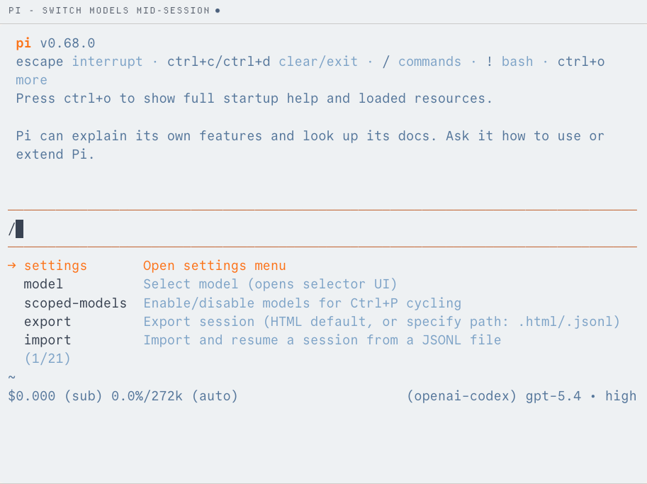

# pi

> 极简 agent harness 的代表，口号很傲娇：有很多 agent 框架，但这个是你的。

## 工具简介

pi 是极简 agent harness 的代表——system prompt 才几千 token，把省 token 做到了极致，反而换来了最强的可定制性：Extensions、Skills、模板随便改。

口号很傲娇：「有很多 agent 框架，但这个是你的」。它的社区 fork OMP（见 [OMP](./29-omp.md)）反而长成了大热门。

## 基本信息

| 项目 | 信息 |
| --- | --- |
| 出品方 | Mario Zechner（badlogic） |
| 工具形态 | 极简 Agent Harness |
| 官网 | <https://pi.dev> |
| 项目地址 | <https://github.com/badlogic/pi> |
| 开源协议 | MIT |
| 收费模式 | 开源免费，模型自带 Key |

## 收录信息

- 收录自「测试开发技术」公众号文章《2026 年 AI 编程工具大全，33 个主流工具一次看懂》
- GitHub 仓库存在性核验于 2026-10
- [返回 AI 编程工具清单](./README.md)
