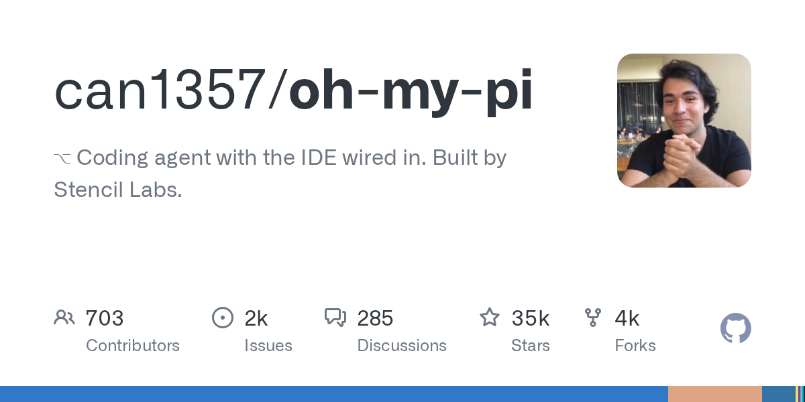

# OMP（Oh My Pi）

> pi 的社区 fork，等于把 CLI 和 IDE 焊在一起。

## 工具简介

OMP（Oh My Pi）是 pi 的社区 fork，Rust 核心，把子代理、计划模式、LSP、调试器、持久记忆全塞了进去——等于把 CLI 和 IDE 焊在一起，40 多家模型供应商任选。

证明了「极简底座 + 社区组装」这条路线的生命力。

## 基本信息

| 项目 | 信息 |
| --- | --- |
| 出品方 | 社区（can1357） |
| 工具形态 | 终端 Agent（pi fork） |
| 官网 | <https://omp.sh> |
| 项目地址 | <https://github.com/can1357/oh-my-pi>（34k+ star） |
| 开源协议 | MIT |
| 收费模式 | 开源免费，模型自带 Key |

## 收录信息

- 收录自「测试开发技术」公众号文章《2026 年 AI 编程工具大全，33 个主流工具一次看懂》
- GitHub 数据核验于 2026-10
- [返回 AI 编程工具清单](./README.md)
