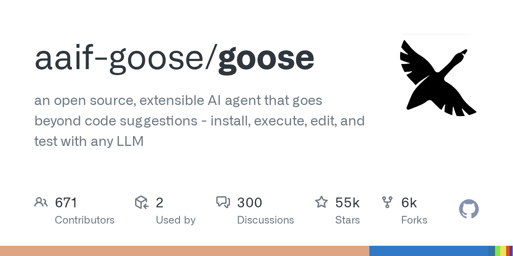

# Goose

> Square 母公司 Block 开源的 agent 框架，社区氛围好。

## 工具简介

Goose 是 Square 母公司 Block 开源的 agent 框架，扩展机制设计得很好，MCP 生态玩得早。后来 Block 把它捐给基金会独立运营——大厂开源里少见的「**真开源**」，社区氛围好。

适合想把 agent 能力嵌进自己工具链（比如测试平台里嵌 agent 跑用例修复）的团队。

## 基本信息

| 项目 | 信息 |
| --- | --- |
| 出品方 | Block（已捐基金会独立运营） |
| 工具形态 | Agent 框架（CLI + 桌面端） |
| 官网 | <https://block.github.io/goose/> |
| 项目地址 | <https://github.com/aaif-goose/goose>（55k+ star） |
| 开源协议 | Apache-2.0 |
| 收费模式 | 开源免费，模型自带 Key |

## 收录信息

- 收录自「测试开发技术」公众号文章《2026 年 AI 编程工具大全，33 个主流工具一次看懂》
- GitHub 数据核验于 2026-10
- [返回 AI 编程工具清单](./README.md)
