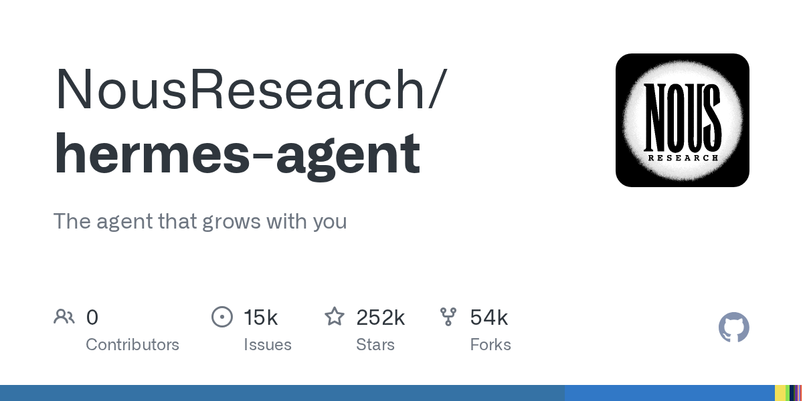

# Hermes

> Nous Research 开源的自主 agent，the agent that grows with you。

## 工具简介

Hermes 是 Nous Research 今年 2 月发布的开源自主 agent，带**持久记忆**——能从使用经验里自己攒技能，越用越懂你。口号是「the agent that grows with you」。

「越用越懂你」的学习型路线，和订阅制工具的「每次都从零开始」形成鲜明对比。

## 基本信息

| 项目 | 信息 |
| --- | --- |
| 出品方 | Nous Research |
| 工具形态 | 自主 Agent（自部署） |
| 官网 | <https://github.com/NousResearch/hermes-agent>（官网即仓库） |
| 项目地址 | <https://github.com/NousResearch/hermes-agent>（252k+ star） |
| 开源协议 | MIT |
| 收费模式 | 开源免费，模型自带 Key |

## 收录信息

- 收录自「测试开发技术」公众号文章《2026 年 AI 编程工具大全，33 个主流工具一次看懂》
- GitHub 数据核验于 2026-10
- [返回 AI 编程工具清单](./README.md)
