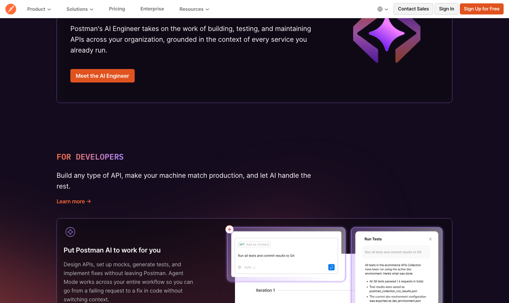

# Postman

> 接口测试的行业默认选项，插件生态和社区没人能打。

## 工具简介

Postman 是接口测试的行业默认选项，界面友好，集合、环境、脚本、Mock、监控全家桶，插件生态和社区没人能打。

缺点也摆在明面上：云端存储的数据主权顾虑，加上 2026 年 3 月起免费版只能单人用、团队协作必须掏钱的新政，很多团队开始往外迁。但瘦死的骆驼比马大，它的生态位短期内还是没人能替代。配套的命令行运行器见 [Newman](./16-newman.md)。

## 基本信息

| 项目 | 信息 |
| --- | --- |
| 出品方 | Postman Inc. |
| 工具形态 | 桌面/Web 协作平台 |
| 官网 | <https://www.postman.com/> |
| 项目地址 | 闭源 |
| 收费模式 | 免费版限单人（2026-03 新政），团队订阅 |

## 收录信息

- 收录自「测试开发技术」公众号文章《别只会用 Postman 了，这 15 款接口测试工具你可能还不知道》
- [返回接口测试工具清单](./README.md)
