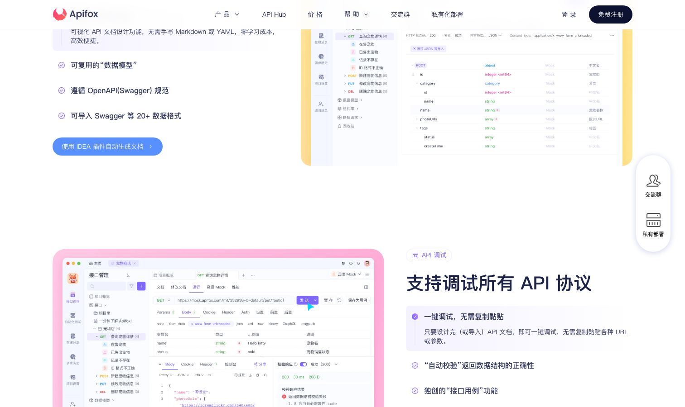

# Apifox

> 国产之光，这波 Postman 迁移潮里吃到最大红利的那个。

## 工具简介

Apifox 的定位一句话说清：**Postman 加 Swagger 加 Mock 加 JMeter 的合体**——API 文档、调试、Mock、自动化测试、性能压测一套系统一份数据，中间不用来回导。

Apifox CLI 支持无头运行，直接挂 CI/CD。团队协作免费政策也比 Postman 厚道，这波迁移动作里吃到了最大红利。

## 基本信息

| 项目 | 信息 |
| --- | --- |
| 出品方 | Apifox（国产） |
| 工具形态 | 桌面/Web 一体化平台 + CLI |
| 官网 | <https://apifox.com/> |
| 项目地址 | 闭源（CLI 部分开源） |
| 收费模式 | 免费额度厚道 + 团队订阅 |

## 收录信息

- 收录自「测试开发技术」公众号文章《别只会用 Postman 了，这 15 款接口测试工具你可能还不知道》
- [返回接口测试工具清单](./README.md)
