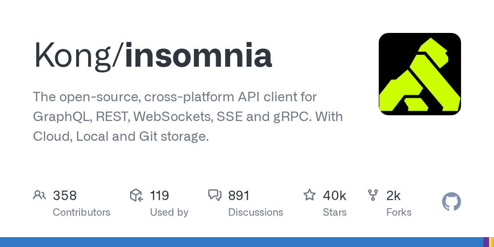

# Insomnia

> Kong 出品，调试手感是强项。

## 工具简介

Insomnia 是 Kong 出品的 API 客户端，主打 REST、GraphQL、gRPC 的调试体验，界面清爽，DevOps 上下文做得好。

适合个人开发者和偏开发自测的团队；测试管理能力比 Postman 弱，调试手感是强项。顺带一提：它的原作者 Greg Schier 后来二次创业做了 [Yaak](./20-yaak.md)，走本地优先 + Git 友好路线。

## 基本信息

| 项目 | 信息 |
| --- | --- |
| 出品方 | Kong |
| 工具形态 | 桌面客户端 |
| 官网 | <https://insomnia.rest/> |
| 项目地址 | <https://github.com/Kong/insomnia>（40k+ star） |
| 开源协议 | Apache-2.0（客户端） |
| 收费模式 | 客户端免费，云同步等增值功能订阅 |

## 收录信息

- 收录自「测试开发技术」公众号文章《别只会用 Postman 了，这 15 款接口测试工具你可能还不知道》
- GitHub 数据核验于 2026-10
- [返回接口测试工具清单](./README.md)
