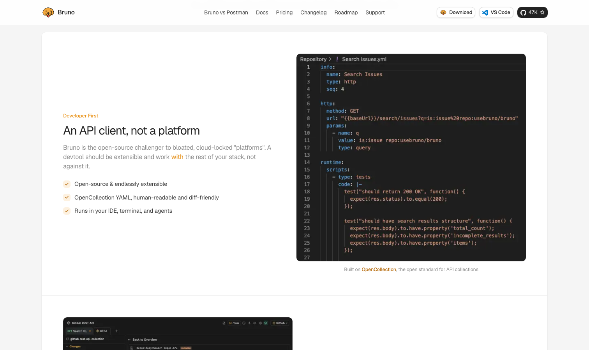

# Bruno

> 这波 Postman 收费潮里最大的受益者，数据主权直接拿回来了。

## 工具简介

Bruno 是这波 Postman 收费潮里最大的受益者。开源免费跨平台，最大特点是**数据全部存本地文件夹**——天生跟 Git 亲和，团队协作靠仓库而不是云端，数据主权直接拿回来了。

支持前置后置脚本、断言、内置测试运行器，概念上就是本地化的 Postman。在意数据主权或只想零成本的团队，一分钱不花，用例还在自己手里。

## 基本信息

| 项目 | 信息 |
| --- | --- |
| 出品方 | Bruno（社区） |
| 工具形态 | 桌面客户端（本地存储） |
| 官网 | <https://www.usebruno.com/> |
| 项目地址 | <https://github.com/usebruno/bruno>（47k+ star） |
| 开源协议 | MIT |
| 收费模式 | 开源免费（云同步服务另售） |

## 收录信息

- 收录自「测试开发技术」公众号文章《别只会用 Postman 了，这 15 款接口测试工具你可能还不知道》
- GitHub 数据核验于 2026-10
- [返回接口测试工具清单](./README.md)
