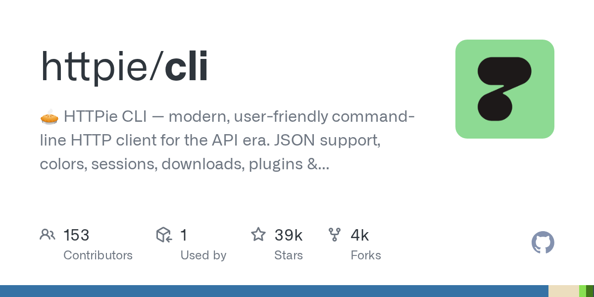

# HTTPie

> 给人类用的 HTTP 客户端，命令行里最舒服的那个。

## 工具简介

HTTPie 是给人类用的 HTTP 客户端——命令行里最舒服的那个，语法直觉到不用记，彩色输出，JSON 处理顺滑。

重写开源之后社区版很好用，写脚本做冒烟、教学生入门都是它。命令行做接口冒烟检查（比如部署完 curl 一圈），HTTPie 是体验最好的那一档。

## 基本信息

| 项目 | 信息 |
| --- | --- |
| 出品方 | HTTPie |
| 工具形态 | 命令行客户端 |
| 官网 | <https://httpie.io/> |
| 项目地址 | <https://github.com/httpie/cli>（38k+ star） |
| 开源协议 | BSD-3-Clause |
| 收费模式 | 开源免费（桌面版商业） |

## 收录信息

- 收录自「测试开发技术」公众号文章《别只会用 Postman 了，这 15 款接口测试工具你可能还不知道》
- GitHub 数据核验于 2026-10
- [返回接口测试工具清单](./README.md)
