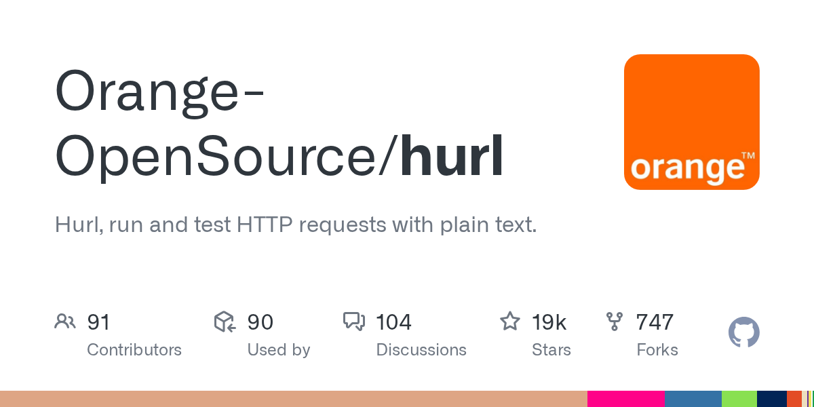

# Hurl

> 把「接口即代码」这条路走到了底。

## 工具简介

Hurl 是基于 curl 的命令行测试工具，用例就是**纯文本文件**——一条请求一行，断言直接写在下面，人能读，git 能管，CI 能跑。

轻到没有存在感，但把「接口即代码」这条路走到了底。纯文本用例进 Git、走 PR、失败即日志，轻量项目真心推荐。

## 基本信息

| 项目 | 信息 |
| --- | --- |
| 出品方 | Orange（橙） |
| 工具形态 | 命令行测试运行器 |
| 官网 | <https://hurl.dev/> |
| 项目地址 | <https://github.com/Orange-OpenSource/hurl>（19k+ star） |
| 开源协议 | Apache-2.0 |
| 收费模式 | 开源免费 |

## 收录信息

- 收录自「测试开发技术」公众号文章《别只会用 Postman 了，这 15 款接口测试工具你可能还不知道》
- GitHub 数据核验于 2026-10
- [返回接口测试工具清单](./README.md)
