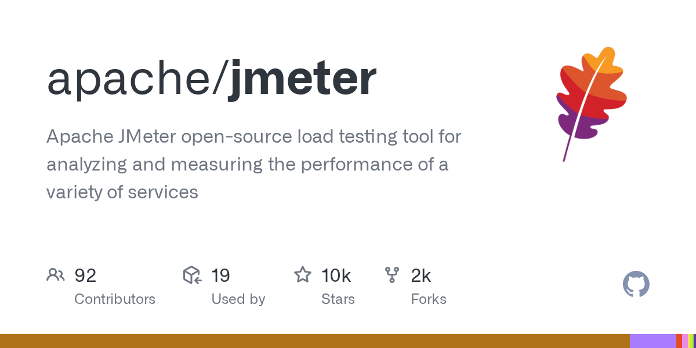

# Apache JMeter

> 老牌全能，接口和性能一把抓。

## 工具简介

Apache JMeter 是 Apache 基金会的老牌开源，Java 写的，图形界面加协议全家桶——HTTP、JDBC、JMS、TCP 都能压。接口测试和性能测试一把抓，插件生态庞大，没编程背景的团队靠它吃饭。

缺点是重，高并发下自身资源占用偏高（分布式压测可解，详见性能测试工具分类）。

## 基本信息

| 项目 | 信息 |
| --- | --- |
| 出品方 | Apache 软件基金会 |
| 工具形态 | 图形界面 + 命令行（GUI / 无头） |
| 官网 | <https://jmeter.apache.org/> |
| 项目地址 | <https://github.com/apache/jmeter>（9.5k+ star） |
| 开源协议 | Apache-2.0 |
| 收费模式 | 开源免费 |

## 收录信息

- 收录自「测试开发技术」公众号文章《别只会用 Postman 了，这 15 款接口测试工具你可能还不知道》
- GitHub 数据核验于 2026-10
- [返回接口测试工具清单](./README.md)
