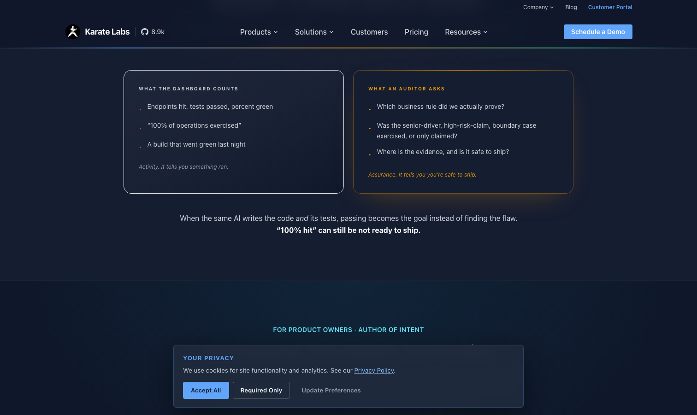

# Karate

> BDD 风格 DSL，脚本即文档，顺手就是验收材料。

## 工具简介

Karate 是 KarateLabs 出品的接口测试框架，BDD 风格的 DSL 写接口测试，不写 Java 代码也能组织复杂场景。一个框架把 API 测试、UI 测试、Mock、性能测试全包了。

脚本即文档，顺手就是验收材料，DSL 上手成本几乎为零——低代码路线的两个默认选项之一（另一个是 [HttpRunner](./14-httprunner.md)）。

## 基本信息

| 项目 | 信息 |
| --- | --- |
| 出品方 | KarateLabs |
| 工具形态 | DSL 测试框架（JVM） |
| 官网 | <https://karatelabs.io/> |
| 项目地址 | <https://github.com/karatelabs/karate>（9k+ star） |
| 开源协议 | MIT |
| 收费模式 | 开源免费（企业版商业） |

## 收录信息

- 收录自「测试开发技术」公众号文章《别只会用 Postman 了，这 15 款接口测试工具你可能还不知道》
- GitHub 数据核验于 2026-10
- [返回接口测试工具清单](./README.md)
