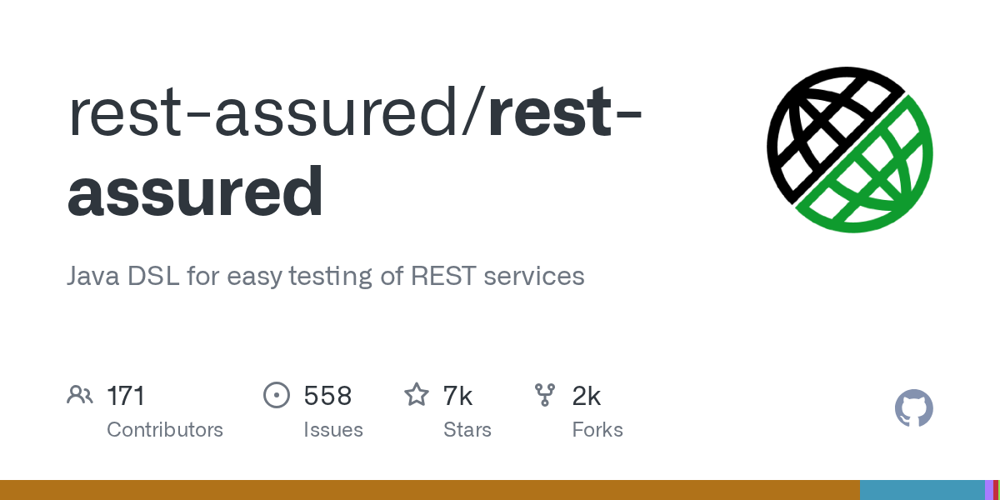

# REST Assured

> Java 生态接口测试的事实标准。

## 工具简介

REST Assured 是 Java 生态接口测试的事实标准，Given-When-Then 的流式语法，跟 TestNG、JUnit、Allure 无缝组合，Spring 工程师写接口自动化基本绕不开它。

适合有代码底子的 Java 团队把接口测试做进工程里——用例就是 Java 代码，进 Maven/Gradle 工程，跟单测同一个仓库同一套 CI。

## 基本信息

| 项目 | 信息 |
| --- | --- |
| 出品方 | REST Assured（社区） |
| 工具形态 | Java 测试库 |
| 官网 | <https://rest-assured.io/> |
| 项目地址 | <https://github.com/rest-assured/rest-assured>（7k+ star） |
| 开源协议 | Apache-2.0 |
| 收费模式 | 开源免费 |

## 收录信息

- 收录自「测试开发技术」公众号文章《别只会用 Postman 了，这 15 款接口测试工具你可能还不知道》
- GitHub 数据核验于 2026-10
- [返回接口测试工具清单](./README.md)
