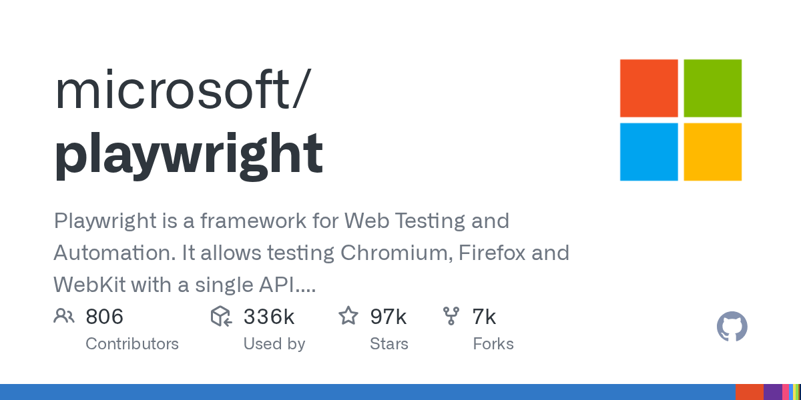

# Playwright API Testing

> API 测试和 AI Agent 场景都是 2026 年官方定位里的一等公民。

## 工具简介

微软的 Playwright 除了驱动浏览器，还带一套 **request 上下文**——直接发 API 请求做断言，和 UI 测试同框混编。UI 前置造数用 API、UI 后置清理用 API，一个框架全搞定。

2026 年官方定位里 API 测试和 AI Agent 场景都是一等公民——对已经在用 Playwright 做 UI 自动化的团队，加接口能力是顺手的事。

## 基本信息

| 项目 | 信息 |
| --- | --- |
| 出品方 | 微软 |
| 工具形态 | 测试框架内置 API 模块 |
| 官网 | <https://playwright.dev/> |
| 项目地址 | <https://github.com/microsoft/playwright>（97k+ star） |
| 开源协议 | Apache-2.0 |
| 收费模式 | 开源免费 |

## 收录信息

- 收录自「测试开发技术」公众号文章《别只会用 Postman 了，这 15 款接口测试工具你可能还不知道》
- GitHub 数据核验于 2026-10
- [返回接口测试工具清单](./README.md)
