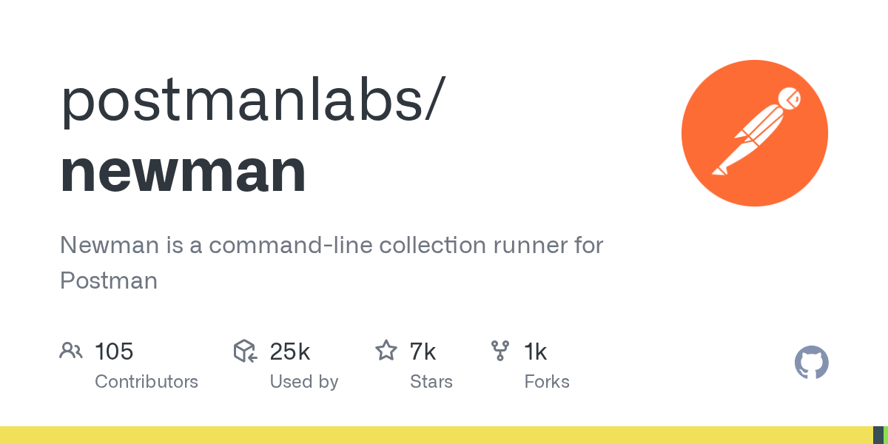

# Newman

> Postman 生态的 CI/CD 入口，`npm install -g newman` 就能跑。

## 工具简介

Newman 是 Postman 官方的命令行 Collection 运行器，弥补 Postman 原生命令行执行能力的不足——**Postman 里手工调通的集合，Newman 无头跑进流水线**。

可直接集成到 Jenkins、GitHub Actions 等 CI/CD 环境，配合 `newman-reporter-htmlextra` 生成精美的 HTML 测试报告。Postman 团队从「手工调试」走到「自动化回归」，中间就隔着一个 Newman。

## 基本信息

| 项目 | 信息 |
| --- | --- |
| 出品方 | Postman 官方 |
| 工具形态 | 命令行运行器（Node.js） |
| 官网 | <https://learning.postman.com/docs/collection-runs/command-line-integration-with-newman/> |
| 项目地址 | <https://github.com/postmanlabs/newman>（7k+ star） |
| 开源协议 | Apache-2.0 |
| 收费模式 | 开源免费 |

## 收录信息

- 检索补充收录（2026-10），GitHub 数据核验于 2026-10
- [返回接口测试工具清单](./README.md)
