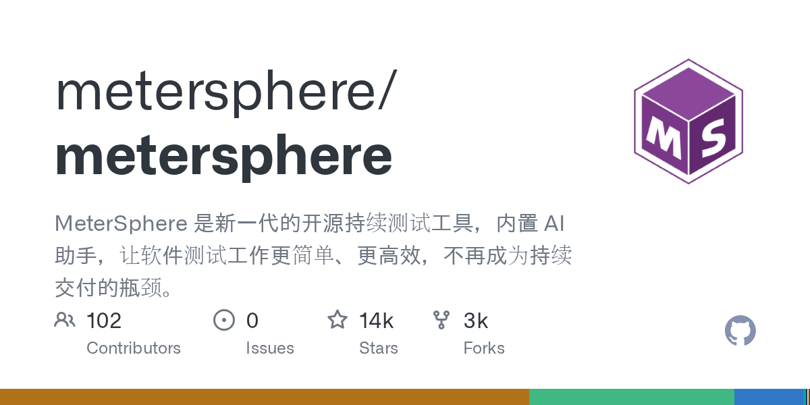

# MeterSphere

> 一站式开源企业级持续测试平台，接口测试是核心模块。

## 工具简介

MeterSphere 是国产一站式开源持续测试平台，涵盖测试跟踪、接口测试、UI 测试、性能测试及团队协作，可融入 DevOps 流程。**兼容 JMeter 等开源标准**，提供标准 RESTful API，可与 Jenkins、GitLab、云效等 CI/CD 平台集成。

对想要「一个平台管全部测试」又不想被商业工具锁死的国内团队，它是开源侧的默认答案之一。

## 基本信息

| 项目 | 信息 |
| --- | --- |
| 出品方 | MeterSphere（飞致云 Fit2Cloud） |
| 工具形态 | 一站式测试平台（自部署） |
| 官网 | <https://metersphere.io/> |
| 项目地址 | <https://github.com/metersphere/metersphere>（13k+ star） |
| 开源协议 | GPL（开源版），企业版商业 |
| 收费模式 | 开源版免费 + 企业版订阅 |

## 收录信息

- 检索补充收录（2026-10），GitHub 数据核验于 2026-10
- [返回接口测试工具清单](./README.md)
