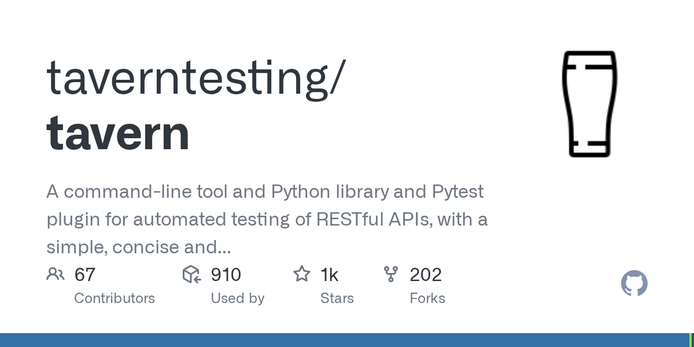

# Tavern

> 仅用一个 YAML 就能实现的接口自动化。

## 工具简介

Tavern 是 pytest 插件、命令行工具和 Python 库三合一的 API 自动化测试工具，用**简洁、灵活的 YAML 语法**描述测试用例，支持 RESTful API 和 MQTT 协议。

相比 Postman 类工具，Tavern 的用例是代码化管理的——进 Git、走 PR、跑在 pytest 生态里。Python 团队想要「YAML 写用例 + pytest 全家桶（fixture、参数化、插件）」，它比 HttpRunner 更轻、更贴 pytest。

## 基本信息

| 项目 | 信息 |
| --- | --- |
| 出品方 | Tavern（社区） |
| 工具形态 | pytest 插件（Python） |
| 官网 | <https://tavern.readthedocs.io/> |
| 项目地址 | <https://github.com/taverntesting/tavern>（1k+ star） |
| 开源协议 | MIT |
| 收费模式 | 开源免费 |

## 收录信息

- 检索补充收录（2026-10），GitHub 数据核验于 2026-10
- [返回接口测试工具清单](./README.md)
