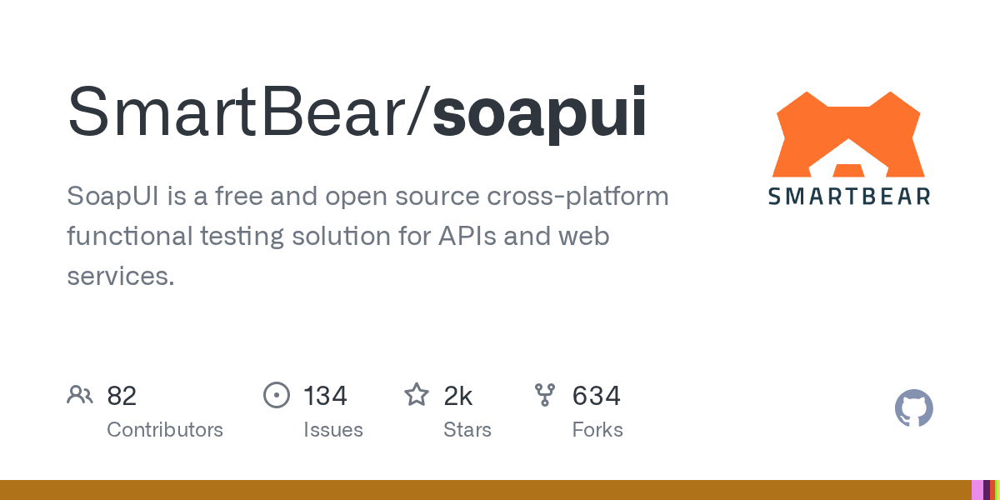

# soapUI

> 老牌开源，SOAP/REST 双修，ReadyAPI 的开源版。

## 工具简介

soapUI 是 SmartBear 的老牌开源测试工具，SOAP/REST 双修——图形界面加 Groovy 脚本扩展，断言、Mock Service、数据驱动都有。

银行、保险、政企这类还有大量 SOAP/WebService 存量系统的场景，soapUI 依然是默认答案。同门的商业版 ReadyAPI 提供更强的测试管理和报表（闭源订阅）。

## 基本信息

| 项目 | 信息 |
| --- | --- |
| 出品方 | SmartBear |
| 工具形态 | 桌面测试工具（Java） |
| 官网 | <https://www.soapui.org/> |
| 项目地址 | <https://github.com/SmartBear/soapui>（1.7k+ star，开源版 5.x） |
| 开源协议 | SmartBear 开源许可（基于 Apache 2.0 变体） |
| 收费模式 | 开源版免费，ReadyAPI 商业订阅 |

## 收录信息

- 检索补充收录（2026-10），GitHub 数据核验于 2026-10
- [返回接口测试工具清单](./README.md)
