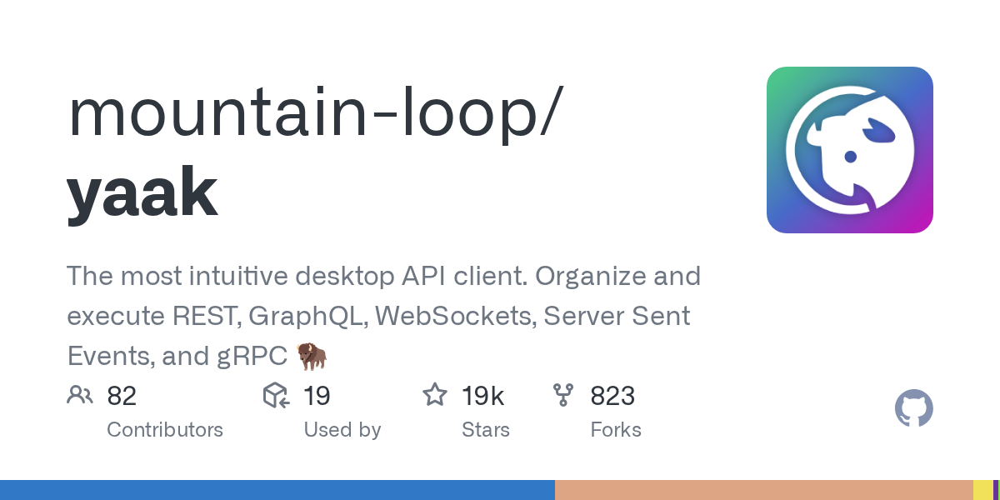

# Yaak

> Insomnia 原创作者 Greg Schier 的二次创业，接 Bruno 的班。

## 工具简介

Yaak 是 Insomnia 原作者 Greg Schier 二次创业做的桌面 API 客户端，**Tauri + Rust + React** 构建——offline-first 本地优先，工作区数据是纯文件，天生 Git 友好。

支持 HTTP、GraphQL、WebSocket、SSE、gRPC 一大票协议，MIT 开源，2026 年的多篇 Postman 替代品对比榜单里都能看到它，是 Bruno 之外另一个「数据在自己手里」的选择。

## 基本信息

| 项目 | 信息 |
| --- | --- |
| 出品方 | Mountain Loop（Greg Schier） |
| 工具形态 | 桌面客户端（本地优先） |
| 官网 | <https://yaak.app/> |
| 项目地址 | <https://github.com/mountain-loop/yaak>（19k+ star） |
| 开源协议 | MIT |
| 收费模式 | 开源免费（云同步增值服务） |

## 收录信息

- 检索补充收录（2026-10），仓库地址经核验修正（原文检索来源误作 `yaakapp/yak`）
- GitHub 数据核验于 2026-10
- [返回接口测试工具清单](./README.md)
