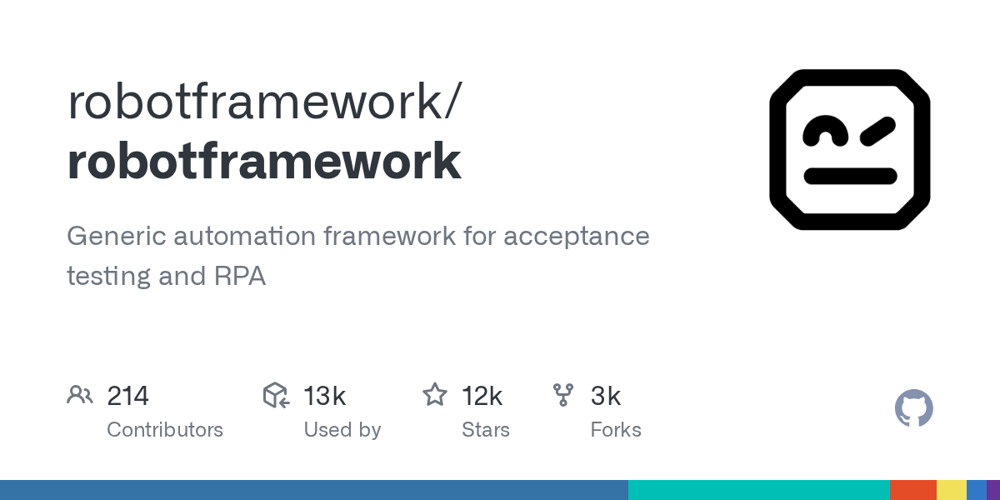

# Robot Framework + RequestsLibrary

> 关键字驱动的代表，用例接近自然语言，业务人员也能读懂。

## 工具简介

Robot Framework 是关键字驱动的自动化测试框架，配上 RequestsLibrary 就能做接口自动化——用例是接近自然语言的表格关键字，不写代码也能组织测试场景，报告开箱即用。

传统企业（银行、电信、政企）的存量自动化里它是大户，低代码测试的代表；配合 RIDE 编辑器可以做到完全无代码。缺点是复杂逻辑的表达能力不如代码框架，深定制要写 Python 关键字。

## 基本信息

| 项目 | 信息 |
| --- | --- |
| 出品方 | Robot Framework 基金会（社区） |
| 工具形态 | 关键字驱动框架（Python） |
| 官网 | <https://robotframework.org/> |
| 项目地址 | <https://github.com/robotframework/robotframework>（12k+ star）；RequestsLibrary：<https://github.com/MarketSquare/robotframework-requests> |
| 开源协议 | Apache-2.0（框架）/ MIT（RequestsLibrary） |
| 收费模式 | 开源免费 |

## 收录信息

- 检索补充收录（2026-10），RequestsLibrary 仓库为 `MarketSquare/robotframework-requests`（已从 robotframework 组织迁移），GitHub 数据核验于 2026-10
- [返回接口测试工具清单](./README.md)
