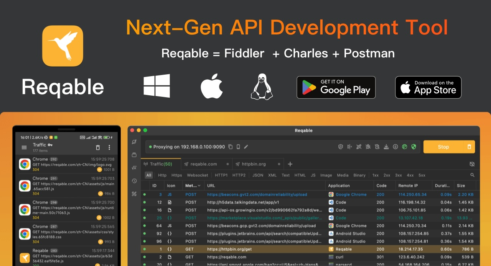

# Reqable

> API 调试 + 抓包一体，前 HttpCanary 作者出品。

## 工具简介

Reqable 是国产 API 调试与抓包一体化工具，由 HttpCanary 的作者出品——**接口调试（类 Postman）和流量抓包（类 Charles）做在同一个客户端里**，再加 API Mock 和重写规则，一条龙覆盖接口测试的日常。

跨平台（桌面 + 移动端抓包场景），免费额度对个人够用，中文界面友好。想在调试和抓包之间不来回切工具的测试同学可以重点关注。

## 基本信息

| 项目 | 信息 |
| --- | --- |
| 出品方 | Reqable（国产，HttpCanary 作者） |
| 工具形态 | 桌面客户端（调试 + 抓包） |
| 官网 | <https://reqable.com/> |
| 项目地址 | 闭源（GitHub `reqable/reqable-app` 为 issue 跟踪仓库，6.8k+ star） |
| 收费模式 | 免费版 + Pro 订阅 |

## 收录信息

- 检索补充收录（2026-10）
- [返回接口测试工具清单](./README.md)
