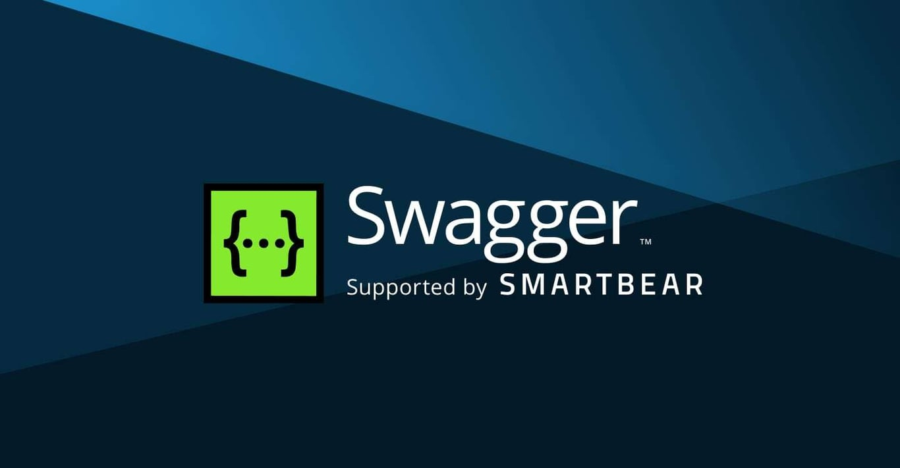

# Swagger Inspector

> SmartBear 在线 API 调试，OpenAPI 生态配套。

## 工具简介

Swagger Inspector 是 SmartBear 的在线 API 调试工具，浏览器里直接发请求调接口，零安装。与 Swagger/OpenAPI 生态配套——调过的接口可以生成 OpenAPI 定义，和 SwaggerHub 设计流衔接。

适合临时调试、不想装客户端的场景；测试管理和自动化能力弱（那是 SmartBear 家 ReadyAPI 的事），定位是轻量在线调试。

## 基本信息

| 项目 | 信息 |
| --- | --- |
| 出品方 | SmartBear |
| 工具形态 | Web 在线工具 |
| 官网 | <https://swagger.io/tools/swagger-inspector/> |
| 项目地址 | 闭源 |
| 收费模式 | 免费（配 SwaggerHub 有订阅层） |

## 收录信息

- 检索补充收录（2026-10）
- [返回接口测试工具清单](./README.md)
