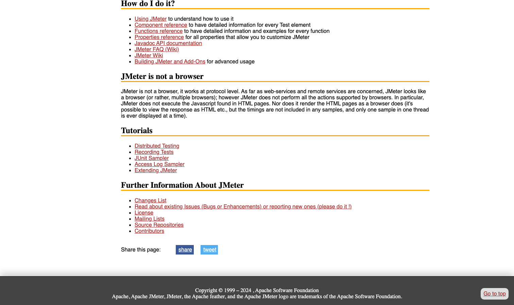

# Apache JMeter

> 老牌双雄之一，会点鼠标就能拼压测场景。

## 工具简介

Apache JMeter 是 Apache 基金会出品、Java 写的图形界面压测工具——协议支持最全，HTTP、JDBC、JMS、TCP、FTP 都能压，插件生态庞大，会点鼠标就能拼场景。

社区实测里它的高并发自身开销偏高，单机 QPS 天花板不如新一代工具——同一台压测机，JMeter 打满和 k6 打满差出来的量级，可能就是结论的对错之分。但胜在门槛低、资料多，**企业里保有量依然是第一**，不会写代码的团队从它起步最稳。接口测试视角的介绍见[接口测试工具分类](../api-testing-tools/11-jmeter.md)。

## 基本信息

| 项目 | 信息 |
| --- | --- |
| 出品方 | Apache 软件基金会 |
| 工具形态 | 图形界面压测工具（Java） |
| 官网 | <https://jmeter.apache.org/> |
| 项目地址 | <https://github.com/apache/jmeter>（9.5k+ star） |
| 开源协议 | Apache-2.0 |
| 收费模式 | 开源免费 |

## 收录信息

- 收录自「测试开发技术」公众号文章《2026 性能测试工具大盘点：13 款主流压测工具，测试工程师必备！》
- GitHub 数据核验于 2026-10
- [返回性能测试工具清单](./README.md)
