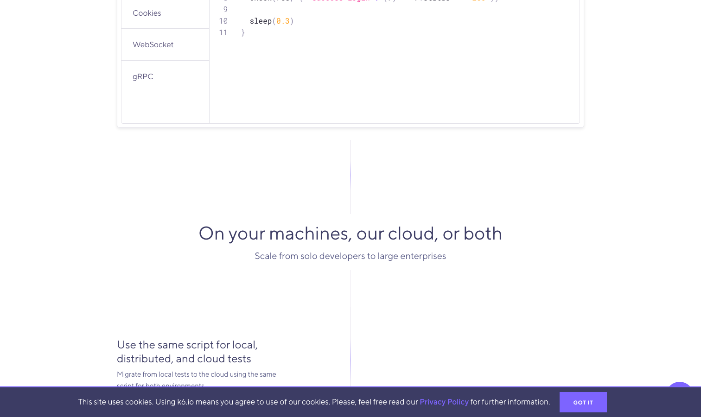

# k6

> 2026 年开发者侧的口碑第一。

## 工具简介

k6 是 Grafana 收购后主推的新一代开源压测工具——Go 写的运行时，JavaScript 写脚本，单机资源占用低，实测 QPS 比 JMeter 高出一截。

云原生和可观测是它的主场：脚本即代码、天然进 CI/CD，和 Grafana 看板无缝联动，浏览器级压测（xk6-browser）也在补齐。会写代码的团队做性能工程化，它和 Locust 是两个默认选项。注意 AGPL-3.0 协议，深度集成进商业产品需评估。

## 基本信息

| 项目 | 信息 |
| --- | --- |
| 出品方 | Grafana Labs |
| 工具形态 | 代码系压测工具（Go + JS 脚本） |
| 官网 | <https://k6.io/> |
| 项目地址 | <https://github.com/grafana/k6>（31k+ star） |
| 开源协议 | AGPL-3.0（商用集成需评估） |
| 收费模式 | 开源免费（Grafana Cloud k6 商业） |

## 收录信息

- 收录自「测试开发技术」公众号文章《2026 性能测试工具大盘点：13 款主流压测工具，测试工程师必备！》
- GitHub 数据核验于 2026-10
- [返回性能测试工具清单](./README.md)
