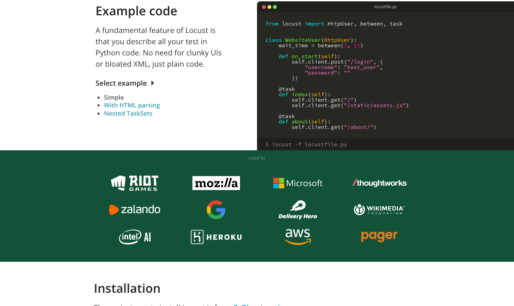

# Locust

> 会 Python 的团队写复杂业务模型特别顺手。

## 工具简介

Locust 是 Python 生态的压测代表——用代码定义用户行为，分布式扩容开箱即用，Web 界面实时看曲线。会 Python 的团队用它写复杂业务模型特别顺手（登录、浏览、下单的流量配比随意编排）。

缺点是单进程性能一般，大规模要靠多进程堆（官方的分布式 worker 机制就是为此设计）。

## 基本信息

| 项目 | 信息 |
| --- | --- |
| 出品方 | Locust（社区） |
| 工具形态 | 代码系压测框架（Python） |
| 官网 | <https://locust.io/> |
| 项目地址 | <https://github.com/locustio/locust>（28k+ star） |
| 开源协议 | MIT |
| 收费模式 | 开源免费 |

## 收录信息

- 收录自「测试开发技术」公众号文章《2026 性能测试工具大盘点：13 款主流压测工具，测试工程师必备！》
- GitHub 数据核验于 2026-10
- [返回性能测试工具清单](./README.md)
