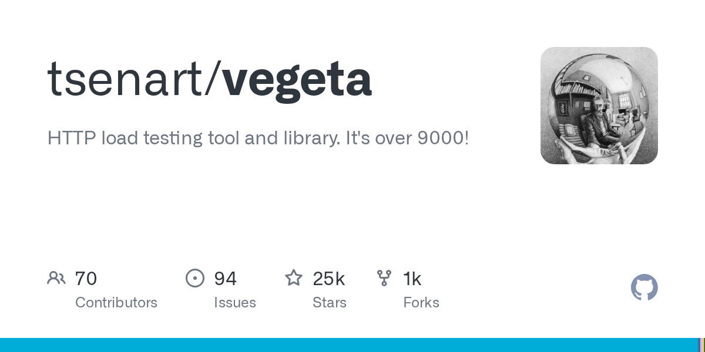

# Vegeta

> 一行命令开火，恒定 RPS 是它的招牌。

## 工具简介

Vegeta 是 Go 写的 CLI 压测工具，主打**恒定速率压测**——一行命令开火，适合测限流和熔断阈值这类需要稳定 RPS 的场景（普通的「尽量快」压测模式下，RPS 波动会让阈值验证失真）。

结果输出 JSON/直方图，配合 jq 或图形脚本快速分析。轻量 CLI 五分钟给服务摸底的第一梯队。

## 基本信息

| 项目 | 信息 |
| --- | --- |
| 出品方 | Vegeta（社区） |
| 工具形态 | CLI 压测工具（Go） |
| 官网 | <https://github.com/tsenart/vegeta>（仓库即入口） |
| 项目地址 | <https://github.com/tsenart/vegeta>（25k+ star） |
| 开源协议 | MIT |
| 收费模式 | 开源免费 |

## 收录信息

- 收录自「测试开发技术」公众号文章《2026 性能测试工具大盘点：13 款主流压测工具，测试工程师必备！》
- GitHub 数据核验于 2026-10
- [返回性能测试工具清单](./README.md)
