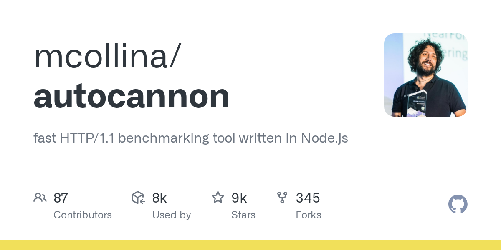

# autocannon

> Node.js 生态最快的 HTTP 基准工具。

## 工具简介

autocannon 是 Node.js 生态最快的 HTTP 基准测试工具——最小配置测原始 RPS 和延迟分位，2026 年多篇对比榜单里它仍是 Node 侧快速微基准的首选，还有可视化 UI（autocannon-ui）。

Node 技术栈团队验证服务（尤其是 Node 服务自身）的吞吐上限，一条命令的事；也可以作为库嵌进测试代码做编程式压测。

## 基本信息

| 项目 | 信息 |
| --- | --- |
| 出品方 | NearForm（Matteo Collina 等） |
| 工具形态 | CLI 基准工具（Node.js） |
| 官网 | <https://github.com/mcollina/autocannon>（仓库即入口） |
| 项目地址 | <https://github.com/mcollina/autocannon>（8.5k+ star） |
| 开源协议 | MIT |
| 收费模式 | 开源免费 |

## 收录信息

- 检索补充收录（2026-10），GitHub 数据核验于 2026-10
- [返回性能测试工具清单](./README.md)
