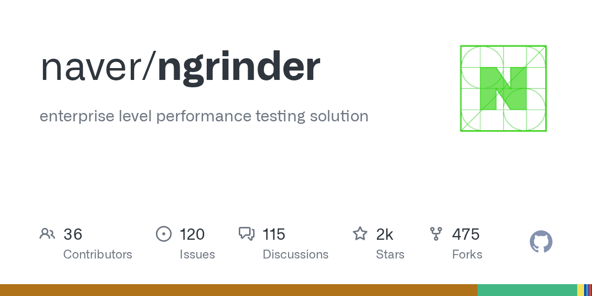

# nGrinder

> JMeter 内核加管控台，自建压测平台的老牌选择。

## 工具简介

nGrinder 是 Naver 开源的压测平台——把 JMeter 内核包了一层管控台，用例管理、集群调度、监控报表都有，适合**企业内部自建压测平台**，韩国系大厂用得多。

对不想给每个测试都配压测环境的团队，管控台 + agent 集群的形态把压测资源平台化了。国内开源对标是 [RunnerGo](./16-runnergo.md)。

## 基本信息

| 项目 | 信息 |
| --- | --- |
| 出品方 | Naver |
| 工具形态 | 压测平台（Web 控制台 + Agent） |
| 官网 | <https://naver.github.io/ngrinder/> |
| 项目地址 | <https://github.com/naver/ngrinder>（2.1k+ star） |
| 开源协议 | Apache-2.0 |
| 收费模式 | 开源免费 |

## 收录信息

- 收录自「测试开发技术」公众号文章《2026 性能测试工具大盘点：13 款主流压测工具，测试工程师必备！》
- GitHub 数据核验于 2026-10
- [返回性能测试工具清单](./README.md)
