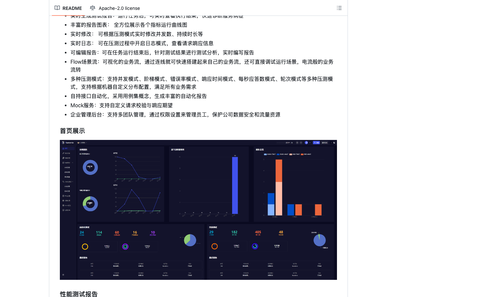

# RunnerGo

> 国产开源全栈测试平台，对国内网络环境友好。

## 工具简介

RunnerGo 是国产开源的全栈式测试平台，Go 语言开发——接口管理、场景自动化、性能压测一个平台全管，**六种压测模式**（连错误率模式和响应时间模式都有），轻量好部署，对国内团队的网络环境友好。

想要国产开源的「接口 + 压测」一体化平台（对标 MeterSphere 的轻量版路线），它是近年的新选项。

## 基本信息

| 项目 | 信息 |
| --- | --- |
| 出品方 | RunnerGo（国产开源） |
| 工具形态 | 全栈测试平台（自部署） |
| 官网 | <https://github.com/Runner-Go-Team/RunnerGo>（仓库即入口） |
| 项目地址 | <https://github.com/Runner-Go-Team/RunnerGo>（809+ star） |
| 开源协议 | Apache-2.0 |
| 收费模式 | 开源免费 |

## 收录信息

- 收录自「测试开发技术」公众号文章《2026 性能测试工具大盘点：13 款主流压测工具，测试工程师必备！》
- GitHub 数据核验于 2026-10
- [返回性能测试工具清单](./README.md)
