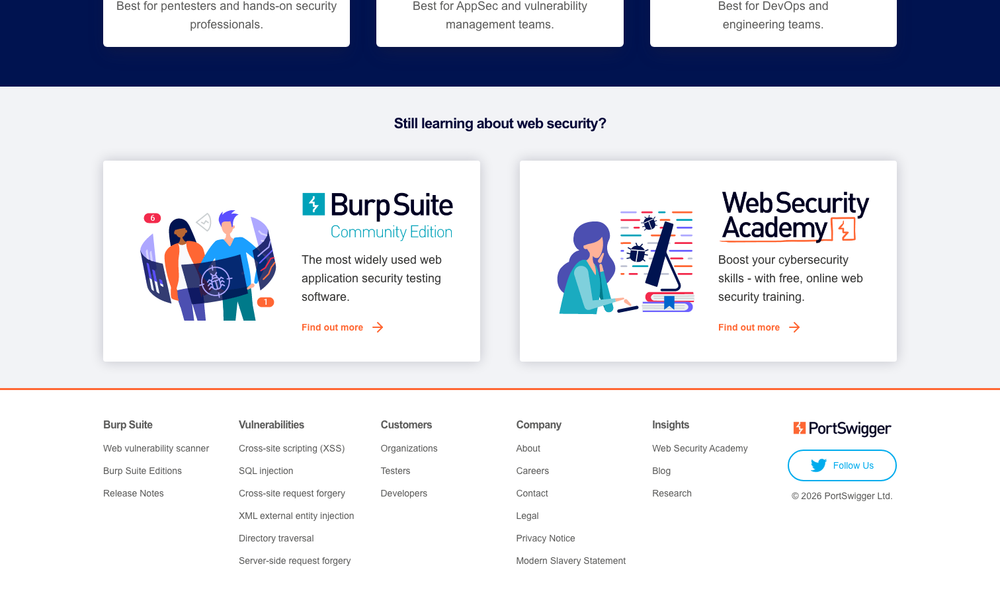

# Burp Suite

> Web 安全圈的绝对标配，渗透测试工程师的左手。

## 工具简介

Burp Suite 是 PortSwigger 出品的 Web 安全测试平台——拦截代理加 Scanner 加 Intruder 加 Repeater，插件生态繁荣到没有它找不到的功能，2026.4 版持续进化。

社区版免费够入门（代理抓包、Repeater 重放），专业版是吃饭家伙（Scanner 自动扫描、Intruder 模糊测试）。手工测 Web 安全，它是绕不开的工作台。

## 基本信息

| 项目 | 信息 |
| --- | --- |
| 出品方 | PortSwigger |
| 工具形态 | Web 安全测试平台（Java） |
| 官网 | <https://portswigger.net/burp> |
| 项目地址 | 闭源（社区版免费） |
| 收费模式 | 社区版免费 + 专业版订阅 |

## 收录信息

- 收录自「测试开发技术」公众号文章《2026 年安全测试工具大全，15 款主流工具一次看懂》
- [返回安全测试工具清单](./README.md)
